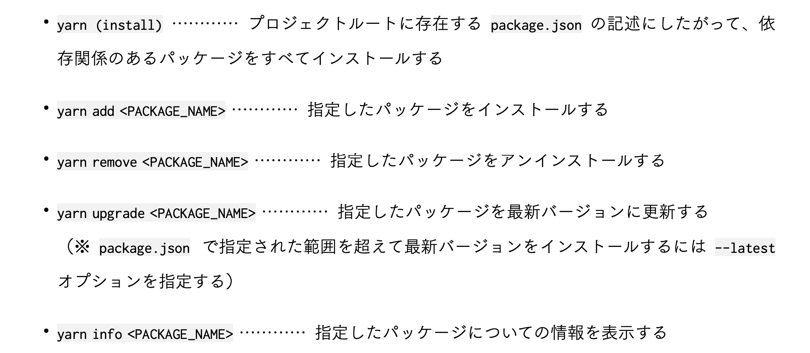

# 1. Hello, React!!

## Vue

Vueは MVVM (Model - View - ViewModel) からなる。MVCアーキテクチャに慣れ親しんでいる場合、Vueの方がとっつきやすい。

## Node.js

### Node.jsとは

Node.js = JavaScriptをPCのターミナル上で動かす事ができるようにするためのソフトウェア。
中の言語処理エンジンはGoogle chrome用のV8を流用している。

※ V8: Google製のオープンソースJavaScriptエンジン。ChromiumベースのブラウザやNode.jsなどのJavaScriptランタイムに採用されている。

### 必要性

- それなりの規模のアプリケーションになってくると、サードパーティ製のライブラリを複数使う。また、それらは相互に特定のバージョンに依存しあっていたりする。
パッケージのインストール、整合性の管理を担ってくれる**npm**を利用するために必要。
- JSやCSSを少数のファイルにまとめるバンドル
- ES6の構文をブラウザに対応した構文にコンパイル
- 開発時にローカルでサーバを立ち上げ、テストする
- テストツールや静的構文解析をローカルで実施する

### インストール

anyenv + nodenv によるインストールが推奨されている。
導入済みのため割愛。

なお、 `anyenv-update` と `nodenv-default-package` というプラグインが推奨されていた。

```zsh
mkdir -p $(anyenv root)/plugins
git clone https://github.com/znz/anyenv-update.git $(anyenv root)/plugins/anyenv-update
mkdir -p "$(nodenv root)"/plugins
git clone https://github.com/nodenv/nodenv-default-packages.git "$(nodenv root)/plugins/nodenv-default-packages"
touch $(nodenv root)/default-packages
vi $(nodenv root)/default-packages
cat $(nodenv root)/default-packages

# default-packagesの中身
yarn
typescript
ts-node
typesync
```

## `create-react-app`

### なんのために?

ReactはUI構築のための必要最小限のライブラリ。そのため、新規プロジェクトのスケルトンを生成してくれるようなコマンド(`rails new`のような)は昔は存在しなかった。
それなりの規模の開発でReactを採用しようとすると、コンパイラやバンドラが必須。それらを導入した上で連携して動作するような設定をする必要があった。

その問題が認識されるようになり、公開から4年経った2016年に Create React App がリリースされた。

### 何をする?

以下のパッケージがインストールされる。

- `react`
  - React本体
- `react-dom`
  - DOMを抽象化し、Reactから操作できるようにする
- `react-scripts`
  - Create React App の魔法(裏に隠れた多数のパッケージを隠蔽)

### Hello, React!

npxを使う。

```zsh
npx create-react-app hello-react --template=typescript
```

`--template=typescript` はTypeScriptのためのテンプレート。

```zsh
yarn start
```

### バンドラとコンパイラ

CRAで作成したプロジェクトでは、ソースコードはBabelによりコンパイルされ、webpackによりバンドルされて適切な形にまとめられ、更にそれらが相互に関連付けられる。

***

アプリを管理するためのコマンドやスクリプト

***

## Yarn

npmコマンドのFacebookによる改良版。

### 基本



`yarn upgrade-interactive [--latest]`

各パケージの更新情報をチェック、対話形式で一括アップデート。

### scripts

`package.json` の `scripts` セクションに定義したコマンドをあたかも Yarn のコマンドかのように扱える。
実行時には `node_modules/.bin/` にパスが通される。

自分で定義することもできるが、予約キーワードや他スクリプトをフックに実行される予約キーワードがあるため注意。
フックの方は大抵 「pre」 というキーワードが入る。

詳細 : https://docs.npmjs.com/cli/v7/using-npm/scripts#life-cycle-operation-order

## react-scripts

実体は `node_modules/react-scripts/scripts` 内にある。

### `start`

開発用サーバの起動

### `build`

本番環境にデプロイするためのファイルを生成

### `test`

テストファイルをソースディレクトリから抽出、テストを走らせる。
起動しっぱなしにしておくと差分を検知してそこだけ実行してくれる。

### `eject`

react-scriptsの庇護から抜け出すためのコマンド。
実行すると隠蔽されていたパッケージが `package.json` に現れる。
また、プロジェクトルートに `config/` が作られ、そこに設定ファイルが置かれる。

今は `eject` せずともwebpack や Babel の設定を変更できるので、庇護に留まることを推奨する。


# 2. The world of JavaScript

## プリミティブ vs オブジェクト

プリミティブ型は、オブジェクトではない、インスタンスメソッドを持たないデータ。
BigIntとSymbolはあまり使われない。

- Boolean
- Number
- BigInt
- String
- Symbol
- Null
- Undefined

## リテラルとラッパーオブジェクト

プリミティブ型の値を定義するときには、**リテラル**を使う。リテラル = 文字通り という意味。

JavaScriptの標準組み込みオブジェクトとして備わっているラッパーオブジェクトというものがある。
プリミティブ型の値に対してアクセスすると、値がラッパーオブジェクトに変換される。ラッパーオブジェクトはメソッドを持つため、あたかもプリミティブ型でメソッドを呼び出せるように見える。

## 文と式

文(Statement)とは、何らかの手続を処理系に命令するもの。
式(Expression)とは、評価された後に値として存在するもの。

変数に代入できるのが式、出来ないのが文。

### 文末のセミコロン

JavaScriptでは文の末尾にはセミコロンが必要。
だが、 `{}` のブロックで終わる場合は付けないという例外規則がある。
関数宣言や `if` の最後に付けないのそのため。

### 関数式と関数宣言

JavaScriptでは式・文のどちらを使っても関数を宣言できる。

```js
// 関数宣言
function foo(message) {
  console.log(message)
}

// 関数式
const foo = function(message) {
  console.log(message)
};
```

`const`で意図しない再代入を防ぐことができるので、関数式の方が推奨。

## 第一級オブジェクト

他のオブジェクト型の値と同様、変数へ代入したり、配列の要素やオブジェクトのプロパティ値にしたり、他の関数に引数として渡したり、別の関数の戻り値に設定出来たりする。
関数を第1級オブジェクトとして扱える性質を第一級関数とも言う。

## 無名関数

関数に名前をつけず定義すると、無名関数になる。
これは、名前がないためメモリに残らず、変数に代入されなければ定義した端から消滅する。

一方で、変数に代入されれば残る。
つまり、関数式による関数の定義というのは、無名関数を生成して、それを変数に代入することを指す。

```js
const foo = () => { console.log("hello, world"); };
```

## プロトタイプ vs クラス

オブジェクト指向には、プロトタイプベースとクラスベースの2種類がある。
JavaScriptはプロトタイプベース。

クラスベースにおけるクラスは、オブジェクトの抽象であり、実体を持たない。

プロトタイプベースでは、オブジェクトの抽象としてのクラスが存在しない。
オブジェクトは、**直接他のオブジェクトを継承する**。このときの継承元となったオブジェクトのことをプロトタイプと呼ぶ。
プロトタイプは、クラスと異なり実体を持つ。

## 分割代入とスプレッド構文

### プロパティ名のショートハンド

```js
> const key="bar"
> const baz=111111
// 変数をキーにしたり、値として展開したりできる
> const obj1 = { foo:123, [key]: 40096, baz: baz }
> obj1
{ foo: 123, bar: 40096, baz: 111111 }

// プロパティ名のショートハンド
// 変数名をキーに、変数の値を値に割り当てる
> const obj2 = { baz }
> obj2
{ baz: 111111 }
```

### 分割代入

```js
const [n, m] = [1, 4];
console.log(n, m); // 1 4

const obj = { name: 'Kanae', age: 24 };
const { name, age } = obj;
console.log(name, age) // => Kanae 24
```

少し複雑な例。 `response` の `data` プロパティの値を `users` に代入。
さらに、 `data` プロパティに値が存在しなかった場合に備えて `[]` をデフォルト値として設定している。

```js
const response = { data: [
{
id: 1,
name: 'Patty Rabbit',
email: 'patty@maple.town', },
{
id: 2,
name: 'Rolley Cocker',
email: 'rolley@palm.town', },
{
id: 3,
name: 'Bobby Bear',
email: 'bobby@maple.town', },
], };
const { data: users = [] } = response;
```

###　コレクションの中身を展開する(スプレッド構文)

本質的にはレストパラメータと同じ。

```js
const arr1 = ['A', 'B', 'C'];
const arr2 = [...arr1, 'D', 'E'];
console.log(arr2); // [ 'A', 'B', 'C', 'D', 'E' ]

const obj1={a:1,b:2,c:3,d:4};
const obj2 = { ...obj1, d: 99, e: 5 };
console.log(obj2); //{a:1,b:2,c:3,d:99,e:5}
```

こんな事もできる。

```js
const user = { id: 1,
name: 'Patty Rabbit', email: 'patty@maple.town', age: 8,
};
const { id, ...userWithoutId } = user;
console.log(id, userWithoutId);
// 1 { name: 'Patty Rabbit', email: 'patty@maple.town', age: 8 }
```

### コレクションのコピー

シャローコピーであることに注意。
再帰的にコピーしたい場合、https://lodash.com/docs/#cloneDeepなどを使う。

```js
const original = { a: 1, b: 2, c: 3 };

const copy = { ...original };
const assigned = { ...original, ...{ c: 10, d: 50 }, d: 100 };
```

## ショートサーキット評価

またの名を短絡評価。
`&&` や `||` といった論理演算子が左→右に評価される性質を利用し、右辺の評価を左辺の評価に委ねる記法。

```js
const hello = undefined || null || 0 || NaN || '' || 'Hello!';
const chao = '' && 100 && [] && {} && 'Chao!';

true&&console.log('1.',hello); //1.Hello!
false&&console.log('2.',hello); //(nooutput)
true || console.log('3.', chao); // (no output)
false||console.log('4.',chao); //4.Chao!
```

## Nullish Coalescing と OPtional Chaining

`??` が **Nullish Coalescing** 、 `?.` でつないでいる部分が **Optional Chaining**という記法。

```js
const users = [
  {
    name: 'Patty Rabbit', address: {
    town: 'Maple Town', },
  },
  {
    name: 'Rolley Cocker',
    address: {},
  },
  null,
];

for (u of users) {
  const user = u ?? { name: '(Somebody)' };
  const town = user?.address?.town ?? '(Somewhere)'; console.log(`${user.name} lives in ${town}`);
}
```

### `?.`

通常のプロパティアクセス演算子(`.` `[]`)では、指定したキーのプロパティが存在しなかった場合、
1階層目なら `undefined` を返すだけだが、2階層以上に渡る場合はタイプエラーになってしまう。

`?.` を使うと、途中のプロパティが存在しなかったらその時点で `undefined` を返してくれる。

例えば `user?.address?.town` と書いた場合、 `address` に `town` が存在しない場合や、 `address` がそもそも存在しない場合でもエラーにならず処理を継続で着る。

### `??`

**coalesce**には癒着する、合体するという意味がある。日本語で nullish coalescing は Null合体演算子。

この演算子は、左辺が `null` または `undefined` の場合だけ右辺が評価される。
OR演算子と異なる点は、 falsy な値の場合は評価されない点。

## `this`

JavaScriptにおける `this` は、**その関数が実行されるコンテキストであるオブジェクトへの参照が格納されている「暗黙の引数」**のこと。

Pythonの `self` とそこまで大きくは変わらない。ただそれが省略可能・外から `call` `apply` `bind` などにより設定可能というだけ。

### アロー関数の場合

例えばメソッド内で定義された関数は、ただの関数。
そのオブジェクトの実行コンテキスト内に無いため、 `this` を参照できない。

アロー関数式で定義すると、実行コンテキスト内の `this` を参照できる。
他にも `bind` で束縛する、 `apply` `call` で明示的に呼び出す、など。

### `this` の挙動への対処

- `this` はクラス構文内でしか使わない
- クラス構文内では、メソッドを含むあらゆる関数の定義をアロー関数式で行う

これにより、 `this` は他のオブジェクト指向言語に慣れた人間が期待する動作になる。

## webpack

CRAで作成されたプロジェクトは、Babelやwebpackが隠蔽されている。
webpackというのは、モジュールバンドラの一種。

ES Modules、CommonJS、AMDを含めた様々なモジュール構文をサポートしていて、使われている構文を自動で検出・適切に解釈してくれるので、異なるモジュール構文が混在していても依存関係を解決してバンドルしてくれる。

### ローダ

WebpackがデフォルトでサポートしているのはJavaScriptのみだが、ローダというモジュールを組み込むことでJSONやCSS、画像ファイルなども扱えるようになる。

### バンドラのお仕事

バンドル = 束ねる、塊など。

- モジュールの依存関係を解決して1つのファイルにまとめる
- Minifyする(空白やコメントの削除、変数名の短縮など)
- Tree Shaking(どこからも参照されていないモジュールを検出してバンドル対象から外し、出力ファイルの容量を削減すること)
- 画像データのインライン埋め込み
- コード分割
- キャッシュ管理

## モジュールの集約

`import` するときは、1つのファイルに一旦全て `export` して、そこから `import` するようにすれば記述量が少なく、スッキリ書けるようになる。

# 3. Functional programming

## 何が嬉しい?

関数型プログラミングは、関数の参照透過性が保たれている。
そのため、処理に副作用を伴いにくく、安全なコードが書ける。

また、宣言型のプログラミングである。
そのため、変数がイミュータブル。処理がミュータブルな変数に依存する場合と比べて、コードが安全。

## 関数の参照透過性

関数型プログラミングの文脈における**関数**は、数学の関数と同じもの。

数学の関数は、与えた引数が同じなら返る値は常に一定。
そういった同じ入力に対して同じ作用・同じ出力が保証されていることを**参照透過性**と呼ぶ。

## 命令型 vs 宣言型

命令型は、最終的な出力を得るために状態を変化させる連続した文により記述されるスタイル。
ステップ順にその指示に従っていけば、目当ての処理ができるイメージ。

宣言型は、出力を得る方法ではなく、出力の性質・あるべき状態を文字通り宣言することでプログラムを構成する。
具体的には、SQLが当たる。SQLのクエリは**どのようにDBにアクセスしてデータを取得してくるか**という手続きではなく、**どんなデータが欲しいかを宣言する**ことで出力が得られる。

宣言型で複雑な処理を行わせるための解の一つが関数型プログラミング。
出力のあるべき状態を数学的に定義している。

### 不変性と可変性

```js
// Procedural
const octuples = [];

for (let n = 1; n < 101; n += 1) {
  if (n % 8 == 0) {
    octuples.push(n);
  }

  console.log(octuples);
}

// Functional
// NOTE
// new Array(n)は長さnの配列を生成する。
// keys()を配列に対して実行するとインデックスを返す?
range = (start, end) => [...new Array(end - start).keys()].map((n) => n + start);
console.log(range(1, 101).filter((n) => n % 8 === 0));

```

関数型は変数に対して一度も再代入や破壊的変更がなされていない。(不変性: Immutability)
それに対して、手続き型は破壊的変更及び再代入が行われている。(可変性: Mutability)

可変性の問題点は、ミュータブルな変数に依存する処理が多ければ多いほどにプログラムの予測可能性が低下し、バグが入り込みやすくなる点。

### 式と文

手続き型が文を多用する一方、関数型では式を組み合わせてプログラムを構成する。

手続き型では値を返さない処理が多くある。
関数型では全てが値を返す式の組み合わせで、それが左辺から右辺へ評価されていき、最終的な値に到達する。
そのため、コードがシンプルになる。

### 全体から構成 vs ボトムアップ

手続き型ではボトムアップ的に積み上げていき、最終成果物を完成させる。
一方関数型では、最初から完成形を見据えた上で大雑把なところから絞り込んでいく形になる。

## コレクションの反復処理

基本となるのはコレクションの反復処理。
`./works/3-fp/iterate.js`を参照。

### `reduce`

reduceの語源は re(再び、元に) + duce(導く)。
第1引数に前回の処理の返り値が入り、第2引数には配列の要素が入る。

### 破壊的メソッドを非破壊的に使う

`slice` メソッドを挟むと良い。
`slice` は配列から任意の葉にをシャローコピーして返すメソッド。引数を省略すると配列全体のコピーを返す。

```js
arr = [1, 5, 3];
arr.slice().sort((n, m) => n < m ? -1 : 1);
```

## オブジェクトの反復処理

`Object.keys` など、 `Object` が持つメソッドを使う。
それぞれプロパティのキー、値、キー・値のペアの配列を返す。

```js
//　オブジェクトの反復処理
const user = {
  id: 3,
  name: "Alice",
  username: "Alice",
  email: "alice@apple.com"
}

console.log(Object.keys(user))
console.log(Object.values(user))
console.log(Object.entries(user))
```

***

## 関数型プログラミング

JavaScriptは第一級関数をサポートしている。
そのため、支障がないレベルで関数型プログラミングを行う事ができる。

関数型プログラミングのパラダイムでは主に次のようなことを行う。

1. 名前を持たないその場限りの関数(無名関数)を定義できる
2. 変数に関数を代入できる
3. 関数の引数として関数を渡したり、戻り値として関数を返すことができる(高階関数)
4. 関数に特定の引数を固定した新しい関数を作ることができる(部分適用)
5. 複数の高階関数を合成してひとつの関数にできる(関数合成)

### 高階関数

引数に関数を取ったり、返り値に関数を返したりする関数。
`map` に渡す無名関数や、コールバックは引数として渡される関数。

関数を返す関数の場合、関数内部で宣言する関数に名前を付ける必要はない。
そのため、無名関数として定義することが多い。以下のように書ける。

```js
const greeter = (target) => () => console.log(`Hi, ${target}!)`);
```

##　カリー化

Haskell Curryという数学者・論理学者の名前を元にしている。
Haskellは純粋関数型言語。

カリー化とは、**複数の引数を取る関数を、より少ない引数を取る関数に分割して入れ子にすること**を指す。

```js
// Pre-curried
{
  const multiply = (n, m) => n * m;
  console.log(multiply(2, 4));
}

// Curried
{
  const withMultiple = (n) => {
    return (m) => n * m
  }
  console.log(withMultiple(2)(4));
}

// Curried with double arrow
{
  const withMultiple = (n) => (m) => n * m;
  console.log(withMultiple(2)(4));
}
```

### カリー化による部分適用

カリー化は**部分適用**に使う。
部分適用とは、特定の引数を固定した新しい関数を作ること。

```js
const withMultiple = (n) => (m) => n * m; console.log(withMultiple(3)(5)); //15
const triple = withMultiple(3);
console.log(triple(5)); // 15
```

引数により左右される何らかの共通処理 + 共通処理に対して引数を渡して出力を得たいような場合に使う。
例) コンポーネントを返す関数があったとして、部分適用により特定コンポーネントを返す関数を作る。その関数に対してコンポーネントのスタイルなどのオプションを渡す。

## クロージャ

Closure.

動作コンテキストごと関数内に閉じ込める。
正確には、関数と「その関数が作られた環境」という2つのものが一体となったオブジェクトのことを指す。
なお、閉じ込めている外側の関数は**エンクロージャ**とも呼ばれる。

必ずしも内側の関数を返す必要はなく、単に外のスコープの自由変数を参照する関数をさらに関数で包み込んだものをクロージャという。


```js
const counter = () => {
  let count = 0;

  const increment = () => {
    return count += 1;
  };

  return increment;
};
```

`count` のような `increment` の引数でもなく、 `increment` 自身のローカル変数でもない変数を自由変数と呼ぶ。

### メモリのライフサイクル

1. 必要なメモリを割り当てる
2. 割り当てられたメモリを使用
3. 必要がなくなれば、メモリを開放する

JavaScriptのような高水準言語は、ガベージコレクタにより不要になったメモリ領域の開放を自動で行う。
「不要」の判定にはいくつか条件があるが、その内の1つに「カレントスコープから参照されているか否か」がある。

JavaScriptでは関数のスコープは **レキシカルスコープ** といい、定義時に決定・固定される。
つまり、自由変数を参照する内側の関数がエンクロージャにより返され、外のスコープで生きている限り、その自由変数は参照され続けるため、GCにより開放されず、状態を保つことができる。

例: 自由変数 `count` は `increment` により参照される。 `increment` は `counter` によって返され、グローバルスコープで生きている。

***

## JavaScriptでの非同期処理

### Promise

`Promise` は非同期処理の最終的な処理結果の値を**約束**するもの。

```js
const isSucceeded = true;

const promise = new Promise((resolve, reject) => {
  if (isSucceeded) {
    resolve('Success');
  } else {
    reject(new Error("Failure!"));
  }
});

promise.then((value) => {
  console.log("1", value);

  return 'Success again';
})
.then((value) => {
  console.log("2", value);
})
.catch((e) => {
  console.error("3", e);
})
.finally(() => {
  console.log("4", "Completed");
});
```

関数型プログラミングの知識があると、上のサンプルをすんなり理解できる。

- `Promise` のコンストラクタに渡しているのは、関数を引数に取り、内部でその関数を実行する関数。
- メソッドチェーンで順に実行するための `then` に引数として渡されるのは関数。

1. コールバック関数 `resolve` に渡した引数が、 `then` の引数の関数で `value` として受け取れる。
2. `then` 内で `return` された値が次の `then` での `value` になる。
3. エラーの場合、 `reject` に渡したエラーが `catch` の引数の関数で `error` として受け取れる。
4. 結果が成功でも失敗でも最後には `finally` が実行される。

### Promiseのハンドリング

node-fetch ライブラリを使ってみる。

`fetch` 関数も `json()` メソッドも `Promise` を返すので、 `then` で受け止めてやる。

```js
import fetch from 'node-fetch'

const getUser = (userId) => fetch(`https://jsonplaceholder.typicode.com/users/${userId}`)
  .then(
    (res) => {
      if (!res.ok) {
        throw new Error(`${res.status} Error`);
      } else {
        return res.json();
      }
    },
  );

console.log("--start--")

getUser(2)
  .then((user) => { console.log(user); })
  .catch((e) => { console.error(e); })
  .finally(() => { console.log("--Completed--") })
```

ただし、コールバックの階層を重ねるような書き方は可読性を損なう上、テストも書きにくい。
そこで、 `async/await` というシンタックスシュガーを使うといい。

## `async/await`

```js
import fetch from 'node-fetch';

const getUser = async (userId) => {
  const response = await fetch(
    `https://jsonplaceholder.typicode.com/users/${userId}`,
  );

  if (!response.ok) {
    throw new Error(`${response.status} error`);
  }

  return response.json();
}

console.log("-start-")

const main = async () => {
  try {
    const user = await getUser(2);
    console.log(user)
  } catch (error) {
    console.log(error);
  } finally {
    console.log("-completed-");
  }
};

main();
```

関数宣言の前に `async` キーワードを、 非同期関数呼び出しの前に `await` キーワードをつける。

`async` キーワードをつけると、その関数は非同期関数となり、返り値が暗黙の内に `Promise.resolve` によりラップされたものになる。
さらに、 非同期関数の中では他の非同期関数を `await` 演算子を付けて呼び出せる。
