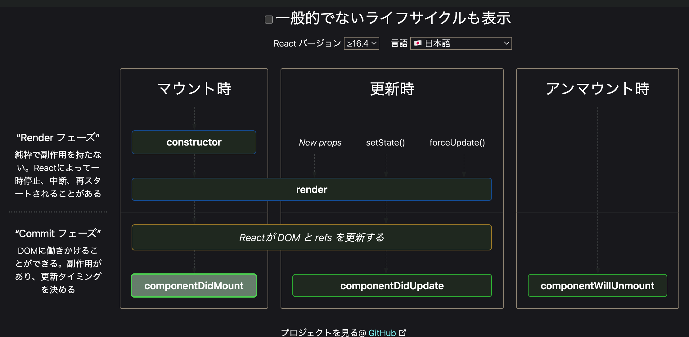
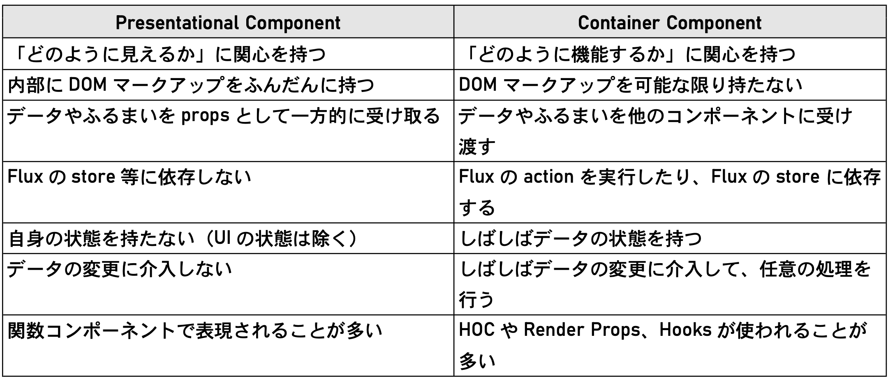

# 8. 何はなくともコンポーネント

# 8-1. コンポーネントのメンタルモデル

## おさらい

Reactは「コンポーネント」という**見た目と機能をカプセル化した再利用可能なパーツ**を組み合わせることでアプリケーションを作る、コンポーネントベースアーキテクチャを採用している。

Reactは仮想DOMをリアルなDOMにレンダリングすることで動作する。
その仮想DOMを構成するのが React Elements。 React Elements はコンポーネントを任意の props でコールするための実行リンクのようなもの。

Scratch のようなビジュアルプログラミングは、用意されたビジュアルブロックをドラッグしてきてロジックの実体に起き、そこに各種パラメータを設定する。
そのイメージで、ブロックの実体がコンポーネント、ロジックの画面にパラメータ付きで置かれたブロックの仮身が React Elements。

## コンポーネントのイメージ

コンポーネントは、JavaScriptの関数のようなものと考えるのが一番近い。
props を引数として受け取り、返り値として React Elements を返す関数。

ただし、コンポーネントが通常の関数と違うのは、個々に「状態」を持つことが出来る点。これを state と呼ぶ。
props か state が変更されれば、コンポーネントのレンダリングに差分が発生する。

仮想DOMの再レンダリングも同じ考え方で理解できる。
Reactの差分検出エンジンは、仮想DOM内の React Elements を全て監視していて、そのどれかの props または 保持している state の値に差分を検出すると、そのコンポーネントのレンダリング処理を再実行する。

たとえばブラウザ上で何らかのイベントが発生し、そこに対応している React Elements の state が 変化したとする。
すると差分検出処理エンジンがそれを検知、新しい state でそのコンポーネント関数を再実行する。
その結果、戻り値の React Elements も変更が生じ、子要素としてコールしていたコンポーネントやその props の値が変わる。
そしてそれらのコンポーネントが新しい props で実行され、、、

といった形でその再レンダリングの波が子孫の要素に連鎖していく。
イメージとしてはぷよぷよに近い。

# 8-2. コンポーネントと props

props と state の内、重要度は props > state 。
何故なら state は極力持つべきではないから。(副作用の原因となるため)

props とはコンポーネントにとっての引数のようなもの。properties を短くして props と呼んでいる。

### VFC vs FC

VFC は Void Function Component 。

従来の `FC` で定義された関数コンポーネントだと、子要素の操作が必要ない場合でも暗黙の内に props の中に子要素のオブジェクトが渡されていた。

より安全にコーディングするには、「子要素をいじっているコンポーネントなのかどうか型で明記されていた方が良い」ということで、現在子要素をいじらない関数コンポーネントの型定義には `VFC` を使うことがコミュニティで推奨されている。

これは TypeScript の話なので一般の開発者には理由がわかりにくい。
こういった話は [React TypeScript Cheatsheets](https://react-typescript-cheatsheet.netlify.app/) に載っている。
TypeScript で React を使うにはかなり参考になるドキュメントの上、頻繁にアップデートが掛けられていてトレンドもわかるので、とりあえず参照しておくと良い。

### `Props` の型定義 : `FC<Props>`

以下にサンプルコード。

```tsx
import { VFC } from "react";
import { Header, Icon, Item } from "semantic-ui-react";

export type Character = {
  id: number;
  name: string;
  grade: number;
  height?: number;
};

type Props = {
  school: string;
  characters: Character[];
};

const CharacterList: VFC<Props> = ({ school, characters }) => (
  <>
    <Header as="h2">{school}</Header>
    <Item.Group>
      {characters.map((character) => (
        <Item key={character.id}>
          <Icon name="user circle" size="huge" />
          <Item.Content>
            <Item.Header>{character.name}</Item.Header>
            <Item.Meta>{character.grade}年生</Item.Meta>
            <Item.Meta>
              {character.height ?? "???"}
              cm
            </Item.Meta>
          </Item.Content>
        </Item>
      ))}
    </Item.Group>
  </>
);

export default CharacterList;
```

まず見るべきなのは、 `Props` という型エイリアスを定義しているところ。
この型はコンポーネントを定義する関数宣言の型適用で使われている。

その下のコンポーネント関数に型を適用しているところでは、 `VFC<Props>` というジェネリクスがある。
このように `VFC` ( `FC` ) に型引数を渡すことで、そのコンポーネントの props の型を指定できる。
props の型を設定することで、そのコンポーネントを JSX でマウントするときに必要な属性値とその型に縛りが発生する。

props から `school` と `characters` を抽出する分割代入の処理を引数に書いている。
この関数は値を1つ返すだけなので、 `return` 文を省略出来る。

なお、 props が無い場合はからオブジェクトを渡して `FC<{}>` とするのが正しい。
ただし、定義で `{}` がデフォルト値として設定されているので省略出来る。

# 8-3. クラスコンポーネントで学ぶ state

## クラスコンポーネントの基本

現在では非推奨となったクラスコンポーネントだが、歴史的経緯から既存のコードはクラスコンポーネントで書かれている事が多い。
そのため、ある程度は読めたほうが良い。

```tsx
import React, { Component, ReactElement } from 'react';
import CharacterList, { Character } from './CharacterList';
import './App.css';

class App extends Component {
  characters: Character[] = [
    {
      id: 1,
      name: '桜木花道',
      grade: 1,
      height: 189.2,
    },
    {
      id: 2,
      name: '流川 楓',
      grade: 1,
      height: 187,
    },
    {
      id: 3,
      name: '宮城リョータ',
      grade: 2,
      height: 168,
    },
    {
      id: 4,
      name: '三井 寿',
      grade: 3,
    },
    {
      id: 5,
      name: '赤木剛憲',
      grade: 3,
      height: 197,
    },
  ];

  render(): ReactElement {
    return (
      <div className="container">
        <header>
          <h1>SLAM DUNK 登場人物</h1>
        </header>
        <CharacterList school="湘北高校" characters={this.characters} />
      </div>
    );
  }
}

export default App;
```

- クラスコンポーネントは `Component` を継承したクラス。
- props に相当する値 (上では `characters` ) がメンバ変数になる。
- 関数コンポーネントはそれ自体が返す値がレンダリング対象になっているのに対して、クラスコンポーネントでは `render` の戻り値がレンダリング対象になる。

```tsx
class CharacterList extends Component<Props> {
  render(): ReactElement {
    const { school, characters } = this.props;

    return (
      <>
        <Header as="h2">{school}</Header>
        <Item.Group>
          {characters.map((character) => (
            <Item key={character.id}>
              <Icon name="user circle" size="huge" />
              <Item.Content>
                <Item.Header>{character.name}</Item.Header>
                <Item.Meta>{character.grade}年生</Item.Meta>
                <Item.Meta>
                  {character.height ?? '???'}
                  cm
                </Item.Meta>
              </Item.Content>
            </Item>
          ))}
        </Item.Group>
      </>
    );
  }
}

export default CharacterList;
```

- props の型定義は `Component<Props>` のようにジェネリクスによる型引数で行う。
- 渡された props へのアクセスはメンバ変数 `props` から行う。

## クラスコンポーネントに state をもたせる

```tsx
import React, { Component, ReactElement } from 'react';
import { Button, Card, Statistic } from 'semantic-ui-react';
import './App.css';

type State = {
  count: number;
};

class App extends Component<unknown, State> {
  constructor(props: unknown) {
    super(props);
    this.state = { count: 0 };
  }

  reset(): void {
    this.setState({ count: 0 });
  }

  increment(): void {
    this.setState((state) => ({ count: state.count + 1 }));
  }

  render(): ReactElement {
    const { count } = this.state;

    return (
      <div className="container">
        <header>
          <h1>カウンター</h1>
        </header>
        <Card>
          <Statistic className="number-board">
            <Statistic.Label>count</Statistic.Label>
            <Statistic.Value>{count}</Statistic.Value>
          </Statistic>
          <Card.Content>
            <div className="ui two buttons">
              <Button color="red" onClick={() => this.reset()}>
                Reset
              </Button>
              <Button color="green" onClick={() => this.increment()}>
                +1
              </Button>
            </div>
          </Card.Content>
        </Card>
      </div>
    );
  }
}

export default App;
```

### state を持つ場合のコンポーネントの引数

`Component<unknown, State>` のように `State` を渡している。

第1引数は props の型。このコンポーネントには props が存在しないので `unknown` を渡している。
デフォルト値は `{}` だが、TypeScriptの解釈では「null 以外のあらゆるオブジェクト」として解釈されてしまうため、使用が禁じられている。
そのため、プロパティを持てないオブジェクトの方である `unknown` がここではふさわしい。

### state の初期化

state の初期化にはコンストラクタが必要。
お約束としてスーパークラスに props を渡すことを忘れないこと。

大事なのは `this.state` に値を設定しているところ。そして、`this.state` の値を直接書き換えて良いのはコンストラクタ内だけであること。
それ以外の場所から値を変更するには、 `setState` メソッドを使う必要がある。

### `setState` メソッド

引数には2種類の値が設定できる。

- state 内の変更したい要素名をキー、値をその値としたオブジェクト
  - e.g. `{count}`
- `(prevState, props?) => newState` 形式の、以前の state (必要なら props も) を引数として受け取って新しい state を返す関数
  - e.g. `(state, props) => ({foo: state.foo + props.bar})`

### React がサポートするイベント

`Button` タグのところ ( `<Button color="red" onClick={() => this.reset()}>` ) では `onClick` イベントハンドラを設定している。

`onDbClick` が `onDoubleClick` になっているなど、純正JSのイベントハンドラとは若干異なる。

### state による単方向データフロー

`Button` コンポーネントの `onClick` に設定した `() => this.increment()` は、親コンポーネントである `App` の state 内の `count` をひとつ加算する関数。
これにより、子コンポーネント `Button` が親コンポーネント `App` の値をさかのぼって直接書き換えること無く、単方向データフローを保ったまま、コールバック関数を介して値を変更している。

### `this` の挙動

`onClick` に渡していた無名関数を以下のように書き換えると、「this.setState is not a function」というエラーが出る。

```tsx
<Button>
- <Button color="green" onClick={() => this.increment()}>
+ <Button color="green" onClick={this.increment}>
    +1
</Button>
```

これは、JavaScriptの不可解な `this` の挙動によるもの。
`increment` はアロー関数ではなく従来型の関数定義なので、その内部で記述した `this` は実行時のオブジェクト、つまり `App` ではなく `Button` になってしまう。

そこで、定義をアロー関数に書き換えてみると正常に動く。

```tsx
// before
  reset(): void {
    this.setState({ count: 0 });
  }

  increment(): void {
    this.setState((state) => ({ count: state.count + 1 }));
  }

// after
reset = (): void => {
    this.setState({ count: 0 });
  }

  increment = (): void => {
    this.setState((state) => ({ count: state.count + 1 }));
  }
```

###  イベントハンドラを省略しない書き方

`e: SyntheticEvent` は、Reactが提供している `SyntheticEvent` という型で定義されるイベントオブジェクト。

`e.preventDefault` はデフォルトの挙動を抑制する。
例えば `<a>` 要素だとクリックでページ移動が起きてしまうので、それをキャンセルするために必要な場合もある。
他にも `<select>` 要素で選択した値を受け取りたい場合、 `onChange` 値に設定した関数内で `e.target.value` にアクセスすれば参照出来る。

```tsx
  reset = (e: SyntheticEvent) => {
    e.preventDefault();
    this.setState({ count: 0 });
  };

  increment = (e: SyntheticEvent) => {
    e.preventDefault();
    this.setState((state) => ({ count: state.count + 1 }));
  };
```

## 学習リソース

[合成イベント (SyntheticEvent) – React](https://ja.reactjs.org/docs/events.html#supported-events)

# 8-4. コンポーネントのライフサイクル

コンポーネントにおけるライフサイクルとは、まずマウントして初期化され、レンダリングされた後、何らかのきっかけで再レンダリングされ、最後にアンマウントされるまでの過程を言う。
アプリケーションの実行中、コンポーネントは何度も再レンダリングされることがあるので「サイクル」という言葉がよく合う。

なぜライフサイクルという明示的な概念がコンポーネントに必要なのかと言うと、コンポーネントベースアーキテクチャのアプリケーションでは各コンポーネントのライフサイクルにおける任意のフェーズに処理を登録しておき、そのタイミングで実行したいことがよくあるため。
フェーズは以下の4つ。

- **Mounting** : コンポーネントが初期化され、仮想DOMにマウントされるまでのフェーズ。
- **Updating** : 差分検出処理エンジンが変更を検知してコンポーネントが再レンダリングされるフェーズ。
  - 変更 = props / state の変更
- **Unmounting** : コンポーネントが仮想DOMから削除されるフェーズ。
- **Error Handling** : 子孫コンポーネントのエラーを検知、補足するフェーズ。

## Mounting

`componentDidMount(): void` コンポーネントがマウントされた直後に呼ばれる。

## Updating

`shouldComponentUpdates(nextProps, nextState): boolean` 変更を検知してから再レンダリング処理の前に呼ばれ、 `false` を返すことで再レンダリングを中止できる。

`componentDidUpdate(prevProps, prevState, snapshot?): void` 再レンダリングの完了直後に呼ばれる。

`getSnapShotBeforeUpdate (nextProps, nextState): SnapShot | null` 再レンダリングの内容がDOMに反映される直前に呼ばれ、返り値でスナップショットを撮っておき、それを `componentDidUpdate` に渡すことが出来る。

## Unmounting

`componentWillUnmount(): void` コンポーネントがアンマウントされて破棄される直前に呼ばれる。



イメージ図 : https://projects.wojtekmaj.pl/react-lifecycle-methods-diagram/

## 16.2系 以前と以後の違い

16.2 系までは componentWillMount, componentWillReceiveProps, componentWillUpdate というライフサイクルメソッドがあった。
これらはレンダリングの直前に実行されるメソッド。
バージョン17から有効化された、最適化された完全非同期なレンダリングと相性が悪く副作用を生みやすいので、16.3以降は公式から非推奨にされ、名前にも `UNSAFE_` というプレフィックスがついている。

# 8-5. Presentational Component と Container Component

## Presentational and Container Components というデザインパターン

一つのコンポーネントを Presentational Component と Container Component に分割しようと言うデザインパターンがある。

presentational は「表現に関する」の名前の通り、純粋に見た目だけを責務とするコンポーネント。
container は presentational をコンテナのごとく抱合してロジックを追加するためのコンポーネント。

紹介元 : [Presentational and Container Components | by Dan Abramov | Medium](https://medium.com/@dan_abramov/smart-and-dumb-components-7ca2f9a7c7d0)

コンポーネントベースアーキテクチャの思想としてはデザインとロジックを閉じ込めたコンポーネントを組み合わせてアプリケーションを作る。

ただ、プロジェクトの継続的な運用を考えると、個々のコンポーネントを見た目だけのコンポーネントとそれにロジックを追加するコンポーネントに分割しておくことは有益。
ロジックから独立して見た目だけを責務としたコンポーネントを分離しておけば、それらをスタイルガイドに登録してデザインの運用に活用できる。
そうすることで既にどんな見た目のコンポーネントがあるか調べやすい上、再利用性も高まる。

## React の流儀 (Thinking in React)

React公式ドキュメントの [React の流儀 – React](https://ja.reactjs.org/docs/thinking-in-react.html) という章で、公式が推奨するコンポーネントの正しい作り方が説明されている。

1. デザインモックからはじめ、そのUIをコンポーネントの構造に分解して落とし込む
2. ロジックを除外した、静的に動作するバージョンを作成する
3. UIを表現するために最低限必要な「状態」を特定する
4. 3 の状態をどこに配置すべきか決める
5. 階層構造をさかのぼって考え、データが上流から流れてくるようにする

↑のデザインパターンを使うことで、 presentational は 1~2 、 container は 3~5 を意識して設計することになり、Reactの流儀に従ったコンポーネントを作ることに自然とつながる。

## presentational / container の関心事




## 学習リソース

[React の流儀 – React](https://ja.reactjs.org/docs/thinking-in-react.html)

[Presentational and Container Components | by Dan Abramov | Medium](https://medium.com/@dan_abramov/smart-and-dumb-components-7ca2f9a7c7d0)
