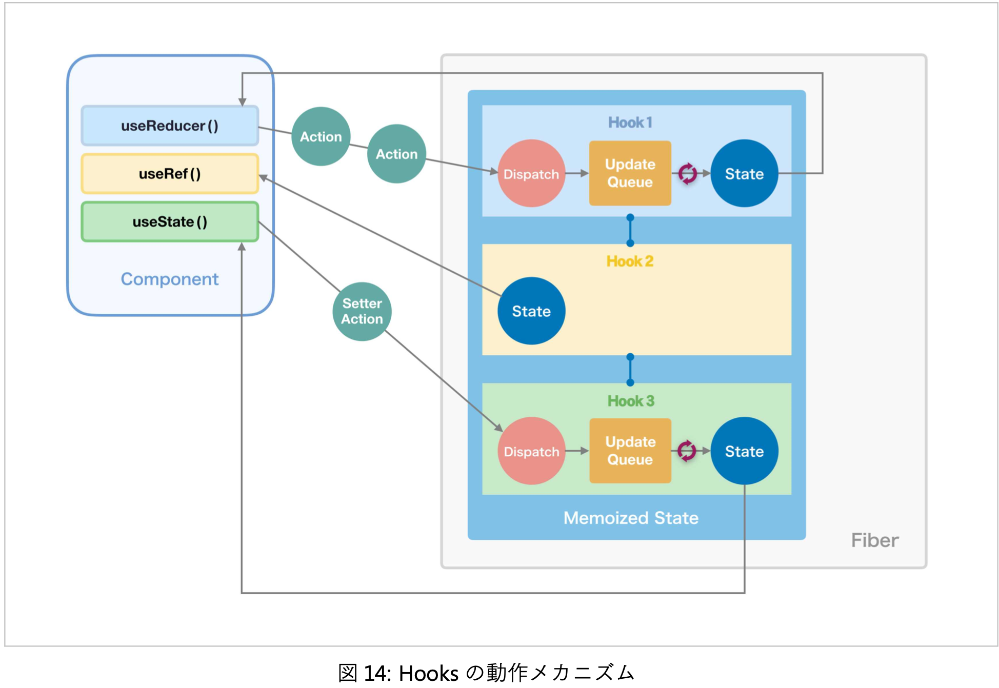

# Reduxでグローバルな状態を扱う

React ではコンポーネントそれぞれが状態を持つ。
そのため、ログインなどのグローバルに保持しておきたい状態の管理に問題を抱えていた。

その解決策となったのが Flux パターン、及びその実装である Redux というライブラリ。


# 11-1. Redux の歴史

## Fluxパターン


- Store ...... アプリケーション全体で参照したい状態データの保管庫
- Action ...... イベントにおける『何をどうしたいか』という意図を表現したもの
- Dispatcher ......actionの種類を判断して、それにひもづけられたstoreの更新処理を行うもの

## Redux

Redux は Flux パターンを実装したライブラリ。2022年現在の覇権。


# 11-2. Redux の使い方

## Redux の思想

- Single source of truth
- State is read-only
- Changes are made with pure functions

Redux において store は状態を格納する1つのステートツリーと、それを更新するための reducer という純粋関数で表現される装置から構成されている。

reducer を極限まで抽象化すると、 `(prevState, action) => newState` という式で表現される。
reducer では状態を内部に抱えず、ただの入出力値として扱う。それによって action が同じであれば、入力した状態と出力された状態の差分も常に同一であることが保証される。

reduce には 「減らす」以外に「還元する」「減数分裂させる」といった意味もある。

## Redux をアプリケーションに組み込む

必要なライブラリは Redux と [React Redux](https://react-redux.js.org/)。

後者は Redux を React バインディングするための公式ライブラリ。
Redux自体はReact専用ではないので、それぞれのフレームワークに組み込むためのバインディングが必要になる。

```zsh
yarn add redux react-redux
(typesync)
yarn
```

## サンプルコード

ディレクトリ構造は以下。
`actions.ts` と `reducer.ts` が Redux 特有のファイル。

```zsh
├── App.css
├── App.tsx
├── actions.ts
├── components
│   ├── molecules
│   │   ├── ColorfulBeads.css
│   │   └── ColorfulBeads.tsx
│   └── organ
│       ├── CounterBoard.css
│       └── CounterBoard.tsx
├── containers
│   ├── molecules
│   │   └── ColorfulBeads.tsx
│   └── organisms
│       ├── CounterBoard-HOC.tsx
│       └── CounterBoard.tsx
├── index.css
├── index.tsx
├── react-app-env.d.ts
├── reducer.ts
├── reportWebVitals.ts
└── setupTests.ts
```

### `index.tsx`

#### `Provider` コンポーネント

```tsx
// index.tsx
import ReactDOM from 'react-dom';
import { createStore } from 'redux';
import { Provider } from 'react-redux';

import { counterReducer, initialState } from 'reducer';
import reportWebVitals from './reportWebVitals';
import App from './App';
import 'semantic-ui-css/semantic.min.css';
import './index.css';

const store = createStore(counterReducer, initialState);

ReactDOM.render(
  <Provider store={store}>
    <App />
  </Provider>,
  document.getElementById('root') as HTMLElement,
);

reportWebVitals();
```

Redux では、上位のコンポーネントで provider コンポーネントを設置しておいて、その子孫のコンポーネントの中でライブラリが提供する Hooks API でその機能を使うようになっている。

provider コンポーネントは `Provider` という名前で、最初に store を初期化、 props として渡してやる必要がある。

#### `createStore`

`Provider` コンポーネントに渡す store を作成する。
引数として reducer と state の初期値を渡す様になっている。

### `action.ts`

```ts
export const CounterActionType = {
  ADD: 'ADD',
  DECREMENT: 'DECREMENT',
  INCREMENT: 'INCREMENT',
} as const;

type ValueOf<T> = T[keyof T];

export type CounterAction = {
  type: ValueOf<typeof CounterActionType>; // 'ADD' | 'INCREMENT' | 'DECREMENT'
  amount?: number;
};

export const add = (amount: number): CounterAction => ({
  type: CounterActionType.ADD,
  amount,
});

export const decrement = (): CounterAction => ({
  type: CounterActionType.DECREMENT,
});

export const increment = (): CounterAction => ({
  type: CounterActionType.INCREMENT,
});
```

サンプルコードにはインクリメント、デクリメント、任意の数の加算という3種類のイベントがあるので、冒頭で `CounterActionType` として3種類のアクションの型を定義している。

更に、 `ValueOf` を使って `CounterAction` が 文字列共用体型 を `type` の型として持つようにしている。

#### action creator

Redux の action は「どんなイベントが起こったのか表現するプレーンなオブジェクト」。

定義している関数 `add` `decrement` `increment` はそれぞれ action を生成する **action creator** と呼ばれる関数。
despatcher に action を発行する際は直接生の値を渡す ( `{type: 'ADD', amount: 10}` のように ) のではなく、 action creator 関数の返り値を使うようにする。

### reducer.ts

```ts
import { Reducer } from 'redux';
import { CounterAction, CounterActionType as Type } from 'actions';

export type CounterState = { count: number };
export const initialState: CounterState = { count: 0 };

export const counterReducer: Reducer<CounterState, CounterAction> = (
  state: CounterState = initialState,
  action: CounterAction,
): CounterState => {
  switch (action.type) {
    case Type.ADD:
      return {
        ...state,
        count: state.count + (action.amount || 0),
      };
    case Type.DECREMENT:
      return {
        ...state,
        count: state.count - 1,
      };
    case Type.INCREMENT:
      return {
        ...state,
        count: state.count + 1,
      };
    default: {
      const _: never = action.type;

      return state;
    }
  }
};
```

#### reducer

reducer とは、 `(prevState, action) => newState` で表現される純粋関数。

この `counterReducer` も state と action を引数にとった上で、 `action.type` によって分岐した中で `count` の値を更新、新しい state を返している。

### `CounterBoard.tsx` (Presentational)

```tsx
import { VFC } from 'react';
import { Button, Card, Statistic } from 'semantic-ui-react';
import './CounterBoard.css';

const BULK_UNIT = 10;
type Props = {
  count?: number;
  add?: (amount: number) => void;
  decrement?: () => void;
  increment?: () => void;
};

const CounterBoard: VFC<Props> = ({
  count = 0,
  add = () => undefined,
  decrement = () => undefined,
  increment = () => undefined,
}) => (
  <Card>
    <Statistic className="number-board">
      <Statistic.Label>count</Statistic.Label>
      <Statistic.Value>{count}</Statistic.Value>
    </Statistic>
    <Card.Content>
      <div className="ui two buttons">
        <Button color="red" onClick={decrement}>
          -1
        </Button>
        <Button color="green" onClick={increment}>
          +1
        </Button>
      </div>
      <div className="fluid-button">
        <Button fluid color="grey" onClick={() => add(BULK_UNIT)}>
          +{BULK_UNIT}
        </Button>
      </div>
    </Card.Content>
  </Card>
);

export default CounterBoard;
```

このコンポーネントでは `count` `add` `decrement` `increment` が全て Redux とつなぎこむ器として props で受け取れるようになっている。

props は2種類に分かれている。

1. 値を参照するだけの `count`
2. `onClick` のコールバック関数として定義されている `add` `decrement` `increment`

この区別で Redux とのつなぎ方が異なる。

### CounterBoard.tsx (Container Component)

```tsx
import { VFC } from 'react';
import { useDispatch, useSelector } from 'react-redux';

import { add, decrement, increment } from 'actions';
import { CounterState } from 'reducer';
import CounterBoard from 'components/organisms/CounterBoard';

const EnhancedCounterBoard: VFC = () => {
  const count = useSelector<CounterState, number>((state) => state.count);
  const dispatch = useDispatch();

  return (
    <CounterBoard
      count={count}
      add={(amount: number) => dispatch(add(amount))}
      decrement={() => dispatch(decrement())}
      increment={() => dispatch(increment())}
    />
  );
};

export default EnhancedCounterBoard;
```

#### `useSelector`

store から任意の state の値を抽出するためのAPI。

引数として、 「state を受け取ってそこから必要な値を抜き出して返す関数」を取る。

型引数は `<CounterState, number>` となっている。
第1引数は store の state ツリー全体の型、第2引数が抽出する state 値の型。

#### `useStore`

store の state をまるごと取得する。
あまり使う機会がない。

#### `useDispatch`

`dispatch` を定義するために使っている。

action を dispatch する、つまり dispatcher に渡すための関数を取得するもの。

action creator 関数を引数に取る。 `dispatch(increment())` のように記述する。

#### 厳密に書くと

`increment` props に渡す関数をレンダリングごとに生成せず、かつボタン要素のデフォルト挙動を抑制しようとするとこうなる。

```tsx
  const increment = useCallback(
    (e: React.SyntheticEvent) => {
      e.preventDefault();
      dispatch(increment());
    }, [dispatch],
  );
  // ...
  return (
    <Counter>
      count={count},
      increment={increment},
      // ...
  )
```

# 11-3. Redux 公式スタイルガイド

[Style Guide | Redux](https://redux.js.org/style-guide/)

Redux 公式が提供しているガイドライン。
3つの優先度がある。

- A: 必須
- B: 強く推奨
- C: 普通に推奨

## 優先度A: 必須

1. state を直接書き換えない
2. reducer に副作用を持たせない
3. シリアライズできない値を state や action に入れない
4. store は1つのアプリにつき1つだけ

### 1. state を直接書き換えない

reducer を始めあらゆる場所で store 内 state の直接書き換えを禁止する。

### 2. reducer に副作用を持たせない

reducer は再現可能な純粋関数であるべき。

そのため、内部で副作用を生じる処理、例えば外部システムと通信したり、reducer の外の変数を書き換えたり、後から同じ値を作れないランダムな値を不用意に store へ渡したりしない。

### 3. シリアライズできない値を state や action に入れない

Promise や 関数 や クラスインスタンス のような、 `JSON.stringfy()` したときに値が同一であることが保証されないものを state や action に入れない。

### 4. store は1つのアプリにつき1つだけ

文字通り。

## アクションに関するルール

5. action を setter ではなくイベントとしてモデリングする : B
6. action の名前は意味を的確に表現したものにする : B
7. action タイプ名を「ドメインモデル/イベント種別」のフォーマットで書く : C
8. action を FSA に準拠させる : C
9. dispatch する action は直に書かず action creator を使って生成する : C

### 5. action を setter ではなくイベントとしてモデリングする : B

ユーザのプロフィールを更新するとき、action を表現するのに setter を使って次のようにしたとする。

```ts
{
  type: "use/setName",
  payload: {id: 387, name: Alice},
}
{
  type: 'user/setBirthday',
  payload: { id: 38792, birthday: new Date('1996-11-24T09:00:00') },
}
```

しかし、これを「発生したイベント」として表現すれば、このようにも書ける。

```ts
{
  type: "user/profileUpdated",
  payload: { id: 38792, name: 'Alice', birthday: new Date('1996-11-24T09:00:00') },
}
```

このようにすることで dispatch される action の数が減る上、 action ログ履歴も見やすくなる。
更に ルール6 の「意味を的確に表現する」も同時に満たすことが出来る。
ついでに ルール7 の「ドメインモデル/イベント種別のフォーマットで書く」というのも同時にやっている。

### 6. action の名前は意味を的確に表現したものにする : B

action の名前は意味を的確に表現したものにする。

上の例では、改善前が `user/setName` `user/setBirthday` 、改善後が `user/profileUpdated` である。
ここで更新されているのは「個々の属性」(前者)ではなく「ユーザのプロフィール」(後者)なので、後者の方がより的確に意味を表現していると言える。

### 7. action タイプ名を「ドメインモデル/イベント種別」のフォーマットで書く : C

`ドメインモデル/イベント種別` というフォーマットで書くこと。
昔は `UPDATE_USER_PROFILE` のように大文字スネークケースで書くことが多く、公式サンプルですらそうなっているコードが散見されるので注意が必要。

例 : `user/profileUpdated`

### 8. action を FSA に準拠させる : C

FSA とは、 action のオブジェクト構造を扱いやすくするよう定められた規約。

この規約では action は `type` 及びオプショナルな `payload` , `error` , `meta` の4要素で構成される。

TypeScriptで表してみると ↓ のような感じ。

```ts
type ActionType = {
  type: string
  payload?: any;
  error?: boolean;
  meta?: { [key: string]: any };
}
```

エラーを表現するものであれば `error` を `true` に、 `meta` にエラー情報を格納する。

正常系であれば `type` `payload` しか使わないことがほとんど。
データは上の階層にそのまま入れてしまいがちだが、 `payload` の中に格納することを徹底するべき。

#### ペイロードとは

> ペイロード 【payload】
> ペイロードとは、有料荷重、有効搭載量、最大積載量、積載物などの意味を持つ英単語。通信・ネットワークの分野において、送受信されるデータの伝送単位（パケットやデータグラムなど）のうち、宛先などの制御情報を除いた、相手に送り届けようとしている正味のデータ本体のことをペイロードという。
>
> [ペイロードとは - 意味をわかりやすく - IT用語辞典 e-Words](https://e-words.jp/w/%E3%83%9A%E3%82%A4%E3%83%AD%E3%83%BC%E3%83%89.html#:~:text=%E3%83%9A%E3%82%A4%E3%83%AD%E3%83%BC%E3%83%89%20%E3%80%90payload%E3%80%91,%E3%81%AE%E3%81%93%E3%81%A8%E3%82%92%E3%83%9A%E3%82%A4%E3%83%AD%E3%83%BC%E3%83%89%E3%81%A8%E3%81%84%E3%81%86%E3%80%82)

### 9. dispatch する action は直に書かず action creator を使って生成する : C

action は action creator 関数により生成する。

## ツールやデザインパターンの利用に関するルール

10. Redux のロジックを書くときは Redux Toolkit を使う : B
11. イミュータブルな状態の更新には Immer を使う : B
12. デバッグには Redux DevTools 拡張を使う : B
13. ファイル構造には「Feature Folder」または Ducks パターンを適用する : B

### 10. Redux のロジックを書くときは Redux Toolkit を使う : B

後述。

### 11. イミュータブルな状態の更新には Immer を使う : B

オブジェクトのイミュータブルな更新を簡単にしてくれる。

例えばブログ記事を表現するオブジェクトがあったとして、その特定のコメントの中身を書き換える更新をしたい場合、スプレッド構文を使って次のように書く。

```js
const article = {
  id: '83214',
  authorId: '3297',
  title: 'My super awesome article',
  body: 'Wow! I wrote such a great article...',
  comments: {
    '213974': {
      id: '213974',
      commenterId: 10983,
      body: 'You are a genius!',
    },
  },
};

const updatedArticle = {
  ...article, comments: {
  ...article.comments, '213974': {
    ...article.comments['213974'],
    body: 'Yaaah!'
    },
  },
}
```

これでは可読性が悪く、バグが混入する恐れがある。
そこで Immer を使う。

```js
import produce from 'immer';
const updatedArticle = produce(article, draftArticle => {
  draftArticle.comments['213974'].body = 'Yaaah!';
});
```

この手のライブラリは一般にパフォーマンスが悪化しがちだが、Immerは多くのケースでスプレッド構文よりも高速。

### 12. デバッグには Redux DevTools 拡張を使う : B

後述。
Redux 開発者の Dan が自ら作った、タイムトラベルデバッギングができるデバッグツール。

### 13. ファイル構造には「Feature Folder」または Ducks パターンを適用する : B

```
// Feature Folder
src/
  features/
    user/
      user-actions.ts
      user-reducer.ts
    article/
      article-actions.ts
      article-reducer.ts
…
// Ducks Pattern
src/
  ducks/
    user.ts
    article.ts
```

Feature Folder はドメイン、サービスにおける関心領域ごとにディレクトリを区切り、その中に action や reducer のファイルを格納する。

Ducks パターンはドメインごとに action や reducer を単一のファイルにまとめて記述する。

**どちらもドメインごとに分けるという点が共通している**。

## その他設計に関するルール

14. どの状態をどこに持たせるかは柔軟に考える : B
15. フォームの状態を Redux に入れない : C
16. 複雑なロジックはコンポーネントの外に追い出す : C
17. 非同期処理には Redux Thunk を使う : C

### 14. どの状態をどこに持たせるかは柔軟に考える : B

Reduxは「Single source of truth」の哲学を掲げてはいるが、「すべての状態を store 内 state に保持すべき」というわけではない。

どのタブが選択されているか、などのUIの状態は個別のコンポーネントのローカルな値として持ったほうが良い。

### 15. フォームの状態を Redux に入れない : C

フォーム管理に Redux を使わない。

推奨フォーム管理ライブラリ : [ホーム | React Hook Form - Simple React forms validation](https://react-hook-form.com/jp/)

### 16. 複雑なロジックはコンポーネントの外に追い出す : C

ルール17と関連。

### 17. 非同期処理には Redux Thunk を使う : C

Redux Thunk は Redux 公式チーム製の非同期処理用ミドルウェア。

りあクト作者は非推奨。
Hooks ファーストの今、Reduxのミドルウェアが本当に必要なのかという点が疑問らしい。

## ルールまとめ

これらのルールは Redux Toolkit を使えば半分くらいは守られる。

- A: 必須
- B: 強く推奨
- C: 普通に推奨

1. state を直接書き換えない : A
2. reducer に副作用を持たせない : A
3. シリアライズできない値を state や action に入れない : A
4. store は1つのアプリにつき1つだけ : A
5. action を setter ではなくイベントとしてモデリングする : B
6. action の名前は意味を的確に表現したものにする : B
7. action タイプ名を「ドメインモデル/イベント種別」のフォーマットで書く : C
8. action を FSA に準拠させる : C
9. dispatch する action は直に書かず action creator を使って生成する : C
10. Redux のロジックを書くときは Redux Toolkit を使う : B
11. イミュータブルな状態の更新には Immer を使う : B
12. デバッグには Redux DevTools 拡張を使う : B
13. ファイル構造には「Feature Folder」または Ducks パターンを適用する : B
14. どの状態をどこに持たせるかは柔軟に考える : B
15. フォームの状態を Redux に入れない : C
16. 複雑なロジックはコンポーネントの外に追い出す : C
17. 非同期処理には Redux Thunk を使う : C

# 11-4. Redux Toolkit を使って楽をしよう

Redux は強力なライブラリではあるが、不満の声も多くあった。
その中で最も多いのは、「必要とされる提携構文が多く、コードの記述量が増える」というもの。

そこで、 React 本体に CRA があるように、 Redux の開発チームも効率的なDXを開発者に提供しようと考えた。
その結果開発されたのが [Redux Toolkit | Redux Toolkit](https://redux-toolkit.js.org/) 。

提供されている主なAPIは以下の4つ。

- `configureStore` ...... 各種デフォルト値が設定可能な createStore のカスタム版
- `createReducer` ...... reducer の作成を簡単にしてくれる
- `createAction` ...... action creator を作成する
- `createSlice` ...... action の定義と action creator、reducer をまとめて生成できる

## `createAction`

action の定義と action creator 関数の定義を楽にしてくれる。
`createAction` の型引数として渡されているのが FSA の payload に相当するものの型。

```ts
import { createAction } from '@reduxjs/toolkit';

const FEATURE = 'counter';
export const added = createAction<number>(`${FEATURE}/added`);
export const decremented = createAction(`${FEATURE}/decremented`);
export const incremented = createAction(`${FEATURE}/incremented`);
```

## `createReducer`

reducer 関数を定義するときの注意点は、引数の型定義。

第2引数 `action` に `PayloadAction` を使った型定義を忘れないこと。

action creator の第1引数 `state` も、同じく型定義が必要。
※ 型定義を省略出来ているのは `createReducer` 自身の第1引数 `initialState` から型推論されているため。

`state` の初期値は、型推論が出来る値を入れると良い。
例えば `state` の型が `id: string | null` だった場合、初期値に `id: null` を渡すと型推論が失敗するので、そういった場合 `as` で型をサジェストすると良い。

```ts
import { createReducer, PayloadAction } from '@reduxjs/toolkit';
import { added, decremented, incremented } from './counter-actions';

export type CounterState = { count: number };
const initialState: CounterState = { count: 0 };

export const counterReducer = createReducer(initialState, {
  [added.type]: (state, action: PayloadAction<number>) => ({
    ...state,
    count: action.payload,
  }),
  [decremented.type]: (state) => ({ ...state, count: state.count - 1 }),
  [incremented.type]: (state) => ({ ...state, count: state.count + 1 }),
});
```

## `createSlice` : action + reducer

action と reducer のロジックを統合したものを 「Slice」 と呼ぶ。
このAPIは Slice を作成する。

`createSlice` を使うとロジックをひとまとめにできる上、必然的にDucksパターンに準拠することになる。

```ts
import { createSlice, PayloadAction } from '@reduxjs/toolkit';

export type CounterState = { count: number };
const initialState: CounterState = { count: 0 };

export const counterSlice = createSlice({
  name: 'counter',
  initialState,
  reducers: {
    added: (state, action: PayloadAction<number>) => ({
      ...state,
      count: state.count + action.payload,
    }),
    decremented: (state) => ({ ...state, count: state.count - 1 }),
    incremented: (state) => ({ ...state, count: state.count + 1 }),
  },
});
```

### `createSlice` : `void` 関数のときの挙動

下のコードでは、 reducer が `(prevState, action) => newState` の形式になっていないどころか、 state の中身を直接書き換えている。

```ts
/* eslint-disable no-param-reassign */
import { createSlice, PayloadAction } from '@reduxjs/toolkit';
import { uuid } from 'uuidv4';

type Task = {
  id: string;
  title: string;
  deadline?: Date;
  createdAt: Date;
};

export type TodoState = {
  todoList: { [id: string]: Task };
  doneList: { [id: string]: Task };
};

export const todoSlice = createSlice({
  name: 'todo',
  initialState: { todoList: {}, doneList: {} } as TodoState,
  reducers: {
    taskCreated: (
      state,
      action: PayloadAction<Pick<Task, 'title' | 'deadline'>>,
    ) => {
      const id = uuid();
      const createdAt = new Date();
      state.todoList[id] = { ...action.payload, id, createdAt };
    },
    taskDone: (state, action: PayloadAction<string>) => {
      const id = action.payload;
      const task = state.todoList[id];

      if (task) {
        state.doneList[id] = { ...task };
        delete state.todoList[id];
      }
    },
    taskUpdated: (state, action: PayloadAction<Omit<Task, 'createdAt'>>) => {
      const { id, ...data } = action.payload;
      const task = state.todoList[id];

      if (task) state.todoList[id] = { ...task, ...data };
    },
  },
});
```

このように reducer が返り値 `void` の関数になっていると、自動的に Immer を適用してイミュータブルな state 更新処理を行うようになっている。

## `configureStore`

トップレベルのファイルに store を仕込む。

```tsx
import ReactDOM from 'react-dom';
import { configureStore } from '@reduxjs/toolkit';
import { Provider } from 'react-redux';

import { counterSlice } from 'features/counter';
import reportWebVitals from './reportWebVitals';
import App from './App';
import 'semantic-ui-css/semantic.min.css';
import './index.css';

const store = configureStore({ reducer: counterSlice.reducer });

ReactDOM.render(
  <Provider store={store}>
    <App />
  </Provider>,
  document.getElementById('root') as HTMLElement,
);

reportWebVitals();
```

### ReduxDevTools extension

- action 発行履歴
- その時点での state の中身
- 任意の時点での sate の再現

などができる。

使うためには通常 `createStore` に設定を仕込む必要があるが、 `configureStore` はデフォルトでそれが設定されている。

# 11-5. Redux と useReducer

## useReducer で Redux の処理を書き直す

Redux ではアプリケーションを包括するグローバルな状態を action と reducer で管理していたが、 useReducer はそれと同じことを個別のコンポーネントで可能にする Hooks API 。

```ts
const [state, dispatch] = useReducer(reducer, initialState);

// 似たようなインターフェースのAPIと比較してみる
const [state, dispatch] = useReducer(reducer, initialState);
const [state, setState] = useState(initialState);
const store = createStore(reducer, initialState);
```

### サンプルコード

```tsx
import { VFC, useReducer } from 'react';
import CounterWidget from 'components/templates/CounterWidget';

const CounterActionType = {
  added: 'counter/added',
  decremented: 'counter/decremented',
  incremented: 'counter/incremented',
} as const;

type ValueOf<T> = T[keyof T];
type CounterAction = {
  type: ValueOf<typeof CounterActionType>;
  payload?: number;
};

type CounterState = { count: number };

const counterReducer = (
  state: CounterState,
  action: CounterAction,
): CounterState => {
  switch (action.type) {
    case CounterActionType.added:
      return {
        ...state,
        count: state.count + (action.payload ?? 0),
      };
    case CounterActionType.decremented:
      return {
        ...state,
        count: state.count - 1,
      };
    case CounterActionType.incremented:
      return {
        ...state,
        count: state.count + 1,
      };
    default: {
      const _: never = action.type;

      return state;
    }
  }
};

const add = (payload: number): CounterAction => ({
  type: CounterActionType.added,
  payload,
});
const decrement = (): CounterAction => ({
  type: CounterActionType.decremented,
});
const increment = (): CounterAction => ({
  type: CounterActionType.incremented,
});

const EnhancedCounterWidget: VFC<{ initialCount?: number }> = ({
  initialCount = 0,
}) => {
  const [state, dispatch] = useReducer(
    counterReducer,
    initialCount,
    (count: number): CounterState => ({ count }),
  );

  return (
    <CounterWidget
      count={state.count}
      add={(amount: number) => dispatch(add(amount))}
      decrement={() => dispatch(decrement())}
      increment={() => dispatch(increment())}
    />
  );
};

export default EnhancedCounterWidget;
```

長いので、 `createSlice` で書き換えてみる。

```tsx
import { VFC, useReducer } from 'react';
import { createSlice, PayloadAction } from '@reduxjs/toolkit';
import CounterWidget from 'components/templates/CounterWidget';

type CounterState = { count: number };
const initialState: CounterState = { count: 0 }; // dummy

const counterSlice = createSlice({
  name: 'counter',
  initialState,
  reducers: {
    added: (state, action: PayloadAction<number>) => ({
      ...state,
      count: state.count + action.payload,
    }),
    decremented: (state) => ({ ...state, count: state.count - 1 }),
    incremented: (state) => ({ ...state, count: state.count + 1 }),
  },
});

const EnhancedCounterWidget: VFC<{ initialCount?: number }> = ({
  initialCount = 0,
}) => {
  const [state, dispatch] = useReducer(
    counterSlice.reducer,
    initialCount,
    (count: number): CounterState => ({ count }),
  );
  const { added, decremented, incremented } = counterSlice.actions;

  return (
    <CounterWidget
      count={state.count}
      add={(amount: number) => dispatch(added(amount))}
      decrement={() => dispatch(decremented())}
      increment={() => dispatch(incremented())}
    />
  );
};

export default EnhancedCounterWidget;
```

## `useReducer` と State Hook の実体

### `useReducer` の嬉しさ

`useReducer` は何が嬉しいのか。

コンポーネントの機能が複雑化してくると state の数が増え、ある state の更新ロジックが別の state を参照するようになる。
大量の state が更新時に相互参照し、さらにそれが `useEffect` の副作用処理の中で行われたりするとどこで更新が起きるのかわかりにくくなる。

そこで、 `useReducer` を使う。
`useReducer` を使えばコンポーネントの state を Redux のようにシングルツリーのオブジェクトに格納して、その中身を reducer によって副作用を排除しつつ更新できるようになる。

### `useState` の実体

実体は1つの setter action しか持たない `useReducer` 。
つまり、複数の state がある場合、最初から `useReducer` を使えば良いということになる。


## Hooks の正体

State Hook は便利だが、クラスコンポーネントが state をメンバー変数として持つのに対して、関数コンポーネントではその状態をどこでどうやって保持しているのか。

### Fiber

React では バージョン16.0 から **Fiber** というレンダリングのためのアーキテクチャを採用している。
Fiber は React Elements に対応する差分検出やデータ更新、再描画のスケジューリングのための最小単位としての意味も持つ。

### Hooks の正体

React が提供する `useXXX` の Hooks API をコンポーネントの中で使用すると、
仮想DOMにマウントされた React Elements と対応する Fiber の「メモ化された状態」領域の中にその Hooks のオブジェクトが作られ、
コールされた順番に従って連結リストとして格納されていく。

下図の Hooks1, Hooks2, Hooks3 がそれ。



Hooks API の呼び出しが生成された Hooks オブジェクトのどれに対応するかはコールされた順番によって称合されるので、もし再レンダリング時に呼び出しの順番が変わるようなことがあるとこの参照がズレてしまう。
Hooks API の使用はコンポーネントの論理階層のトップレベルで行い、条件文やループの中で使ってはいけないというルールがあるのはそれが理由。

そして、Hooks のオブジェクトはそれぞれ固有の state を持っていて、対応する Hooks API コールが返す値はそこへの参照。

### `useReducer` の動作

`useReducer` は Hooks オブジェクト固有の state を Redux ライクな action と reducer を使った仕組みで更新するようになっている。

ただし、Redux と全く同じというわけではない。
APIの返り値 `dispatch` 関数に `action` を渡して実行すると、それがすぐさま reducer に渡されるのではなく、 Hooks オブジェクトの中に用意された「更新キュー」へ発行した action が追加されていく。

そして、React の差分検出エンジンが最適化されたタイミングでそのコンポーネントの再レンダリングを実行すると、描画直前にキューの中に溜まっていた action が reducer に渡され、キューの分だけ `(prevState, action) => newState` が実行された最終結果が `state` に反映される。

### `useState` の動作

返り値として `useReducer` における dispatcher の代わりに setter 関数を返している。
その実体は setter action だけを発行する専用の dispatcher で、対応する Hooks オブジェクトの動作は全く一緒。
