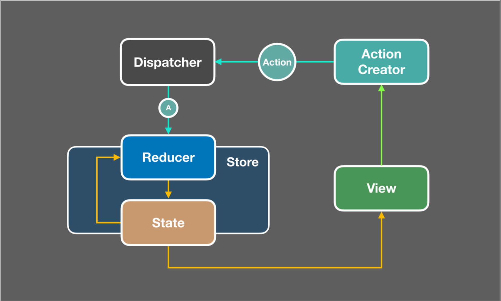
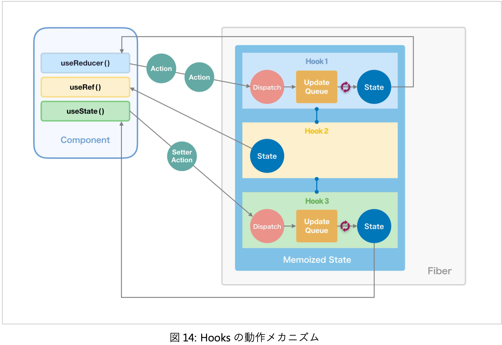
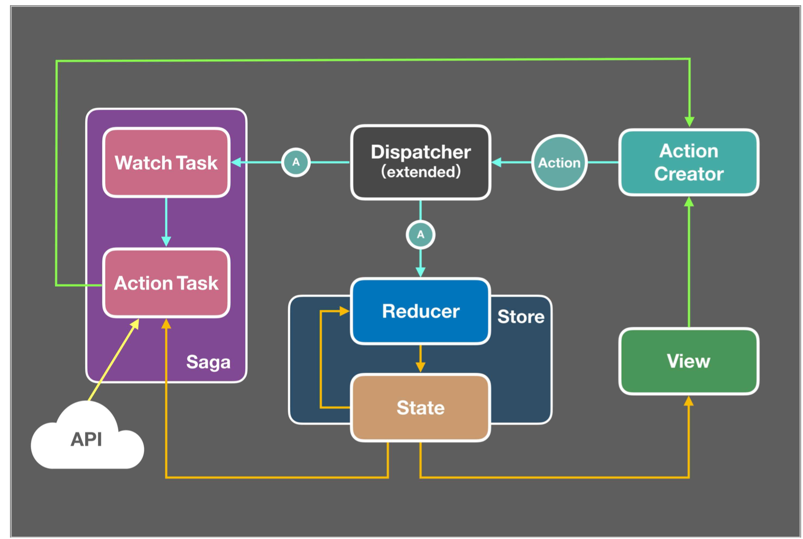

# 12-1. 過ぎ去りし Redux ミドルウェアの時代

React は JavaScript 製のライブラリなので外部との通信処理を行うときは必然的に非同期処理になる。
通信を含むそういった副作用を生む非同期処理をどう記述してどこに置くかというのは React でアプリケーションを作る開発者達にとって大きな課題だった。

当初の React は 公式にはデータフローについて一切関知しない、UI 構築に特化したライブラリという立場を取っていた。
そのため、 React が公開されてから、開発者たちはこの問題を解決するために様々な方法を試してきた。

## コンポーネントの中で非同期処理を行う

まず思いつく方法はコンポーネントの内部に処理を置く方法。

ライフサイクルメソッドやイベントハンドラから呼ばれる関数内で非同期処理を実行、その結果をコンポーネントの state に格納して取り回す形。

```tsx
class EnhancedMembers extends Component<{}, { users: User[] }> {
  constructor(props: {}) {
    super(props);
    this.state = { users: [] };
  }

  componentDidMount = async (): Promise<void> => {
    const response = await fetch('https://api.github.com/orgs/facebook/members');
    if (response.ok) {
      const members = await response.json() as User[];
      this.setState({ members });
    }
  };
}
```

この方法だと、多くの問題が発生sルウ。

ライフサイクルメソッドは時間軸に従って書く必要があるため、例えば同じ処理を `componentDidMount` と `componentDidUpdate` に重複して書かなければいけない。
それゆえ、副作用のロジックを分離して再利用するのが難しい。

## Redux ミドルウェア

Redux が爆発的に普及したことで、非同期処理周りの状況が大きく変わる。
Redux はデータフローを整理するための Flux アーキテクチャを実装したライブラリなので、これに非同期処理も任せれば良いのではと皆が考えるようになったのは自然な流れ。

Redux にはミドルウェアという仕組みが用意されている。
外部から dispatcherを拡張、 reducer の実行前後に任意の処理を追加するもの。

`createStore` の正式なインターフェースを見てみると、第3引数が存在する。

```ts
createStore(reducer, initialState?, enhancer?)
```

この `enhancer` に Redux の `dispatch` をラップした処理が記述されたミドルウェアを適用出来る。

```ts
import { createStore, applyMiddleware } from 'redux';
import awesomeMiddleware from 'awesome-middleware';
import { reducer, initialState } from './reducer';

const store = createStore(reducer, initialState, applyMiddleware(awesomeMiddleware));
```

御三家とも言える Redux Thunk 、 redux-saga および redux-observable を始め、様々な非同期処理を扱うミドルウェアが作られた。

## 公式謹製 Redux Thunk

作者は Redux オリジナルの作者、 Dan Abramov 。
「thunk」というのはCSの用語で、関数型プログラミングによって計算の遅延評価を行う際、その引き渡される計算の実体のことを言う。

通常の Redux では dispatcher にプレーンオブジェクトの action しか渡すことが出来ないが、 Redux Thunkを組み込むことでその thunk も dispatcher に渡せるようになる。
そして、 dispatcher の中で thunk の内容の評価が行われる。

Redux Thunk は端的に言うと、 dispatcher を拡張して純粋な action 以外にも 副作用を内包した関数 や `Promise` オブジェクト なども dispatch 出来るようにするミドルウェア。
action creator が魔改造されるイメージ。

図で比較すると以下のような感じ。

Redux


Redux Thunk


action creator のサンプル。

```ts
const increment = () => (
  { type: 'INCREMENT',}
);
const delayedIncrement = () => (dispatch) => {
  setTimeout(() => {
    dispatch(increment());
  }, 1000);
};
```

`delayedIncrement` は view から `dispatch(delayedIncrement)` のようにコールされる。
すると、高階関数 `delayedIncrement` の内側の `dispatch` を引数にした関数が dispatch されてそれが dispatcher の中で実行される。
そして `setTimeOut` で1秒後に `increment` の実行結果 `INCREMENT` の action が改めて dispatch される。

### メリットとデメリット

Redux Thunk はその仕組み上、どうしてもコールバック地獄に陥りやすい。
そのため、少数精鋭のチームでもない限り運用は難しい。

Pros

- Redux 公式チーム謹製で、公式スタイルガイドでも使用が推奨されている
- ライブラリがシンプルで、サイズも minify & gzip して 236B と小さい
- コードのボイラープレートが少なくて済む
- 学習コストが低い(ように最初は見える)

Cons

- action creator が副作用を持ったり action creator 自身が dispatch されるなど、Redux データフロー本来の純粋なあり方からかけ離れてる
- action creator が callback hell に陥りやすい
- action creator のテストが複雑になる

## redux-sage

[Redux-Saga - An intuitive Redux side effect manager. | Redux-Saga](https://redux-saga.js.org/)

redux-sage の大きな特徴は、副作用を隔離するためにその処理機構がアプリケーションから独立したスレッドのようなところで動く点。
そしてそのスレッドは store state にアクセスしたり action を dispatch したり出来て、それ自体はメインのアプリケーションから action の発行を通じて開始・停止・キャンセルの操作ができる。

実行させたい副作用を伴う非同期処理を「タスク」として登録。
その中の監視用に登録されたタスクは、アプリが起動したときに専用のスレッドが立ち上がって待機するようになっている。
その後 view から action が dispatch されると、 dispatcher は reducer に加えて sage にも action を引き渡す。
saga の監視タスクは対象のアクションが来るのを待っていて、 action が渡されてきたら、その種類の action 用に予め登録してあった別のタスクを起動する。
起動された処理タスクはその結果を他の action に格納した上で、それを改めて dispatch する。

つまり、Redux の仕組みとは独立したところで目当ての action が来ないか待ち構える。
そしてその action が来たら、該当する作業タスクを起こして任意の処理を実行する。



### Saga パターン

Sage パターンとは、主にマイクロサービスアーキテクチャの文脈で分散トランザクションを実現するための解決策として提案されたデザインパターンのこと。
複数のサービスにまたがるリソースを対象とした複数のトランザクション処理を、任意のイベントをトリガーに連続して実行していくもの。

この一連のワークフローを「Sage(物語、神話)」と呼ぶ。
Saga は各サービスが返すドメインのデータに加えて、処理の進行状況を表す状態の2つの情報を持つ。

Saga パターンはドメインをまたがって複数のサービスAPIを利用する現代の SPA と親和性が高い。

### ジェネレータ

redux-sage は非同期処理を同期的に記述するために JavaScriptのジェネレータを使っている。

```js
// SEE: https://codesandbox.io/s/generator-stepto-02vwp

function* stepTo(end, start = 1) {
  for(let n = start; n < end; n++) {
    yield n;
  }

  yield end * 10;
}
const gen = stepTo(3);
console.log(gen.next()); //Object{value:1,done:false}
console.log(gen.next()); //Object{value:2,done:false}
console.log(gen.next()); //Object{value:3,done:false}
console.log(gen.next()); //Object{value:30,done:false}
console.log(gen.next()); //Object{value:undefined,done:true}
```

### メリット・デメリット

Pros

- 副作用処理をアプリケーションから完全に分離できる
- 非同期処理を同期的に書ける
- テスタビリティが高い

Cons

- コードのボイラープレートが多い
- ジェネレータや独自の DSL ライクな API コールなど、書き方にクセがある
- Saga の全体フローや豊富な Effects API の使い方を理解するための学習コストが高い
- ライブラリのバンドルサイズが大きい(minify & gzip で 5.3KB。Thunk は 236B、 redux-observable は 1.5KB)
