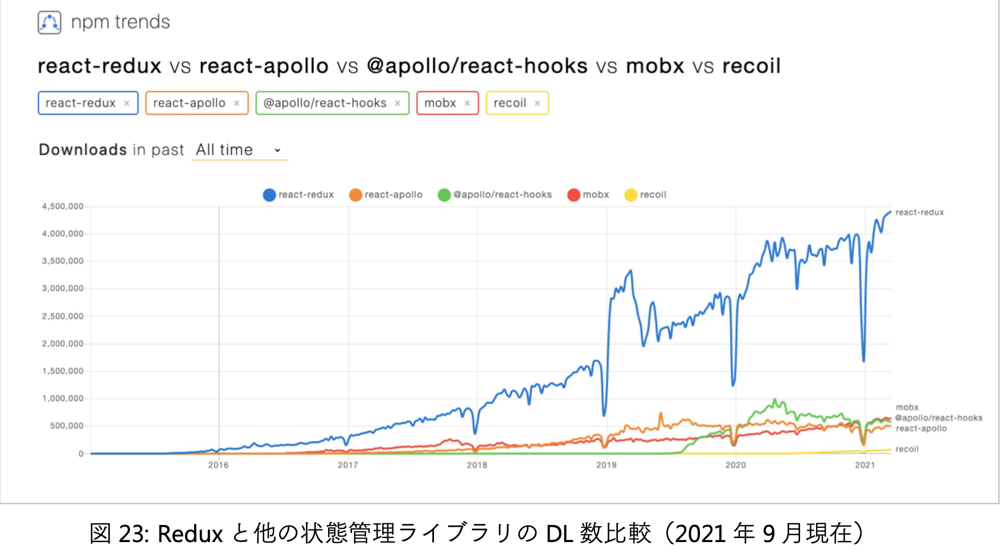

# 12-1. 過ぎ去りし Redux ミドルウェアの時代

React は JavaScript 製のライブラリなので外部との通信処理を行うときは必然的に非同期処理になる。
通信を含むそういった副作用を生む非同期処理をどう記述してどこに置くかというのは React でアプリケーションを作る開発者達にとって大きな課題だった。

当初の React は 公式にはデータフローについて一切関知しない、UI 構築に特化したライブラリという立場を取っていた。
そのため、 React が公開されてから、開発者たちはこの問題を解決するために様々な方法を試してきた。

## コンポーネントの中で非同期処理を行う

まず思いつく方法はコンポーネントの内部に処理を置く方法。

ライフサイクルメソッドやイベントハンドラから呼ばれる関数内で非同期処理を実行、その結果をコンポーネントの state に格納して取り回す形。

```tsx
class EnhancedMembers extends Component<{}, { users: User[] }> {
  constructor(props: {}) {
    super(props);
    this.state = { users: [] };
  }

  componentDidMount = async (): Promise<void> => {
    const response = await fetch('https://api.github.com/orgs/facebook/members');
    if (response.ok) {
      const members = await response.json() as User[];
      this.setState({ members });
    }
  };
}
```

この方法だと、多くの問題が発生sルウ。

ライフサイクルメソッドは時間軸に従って書く必要があるため、例えば同じ処理を `componentDidMount` と `componentDidUpdate` に重複して書かなければいけない。
それゆえ、副作用のロジックを分離して再利用するのが難しい。

## Redux ミドルウェア

Redux が爆発的に普及したことで、非同期処理周りの状況が大きく変わる。
Redux はデータフローを整理するための Flux アーキテクチャを実装したライブラリなので、これに非同期処理も任せれば良いのではと皆が考えるようになったのは自然な流れ。

Redux にはミドルウェアという仕組みが用意されている。
外部から dispatcherを拡張、 reducer の実行前後に任意の処理を追加するもの。

`createStore` の正式なインターフェースを見てみると、第3引数が存在する。

```ts
createStore(reducer, initialState?, enhancer?)
```

この `enhancer` に Redux の `dispatch` をラップした処理が記述されたミドルウェアを適用出来る。

```ts
import { createStore, applyMiddleware } from 'redux';
import awesomeMiddleware from 'awesome-middleware';
import { reducer, initialState } from './reducer';

const store = createStore(reducer, initialState, applyMiddleware(awesomeMiddleware));
```

御三家とも言える Redux Thunk 、 redux-saga および redux-observable を始め、様々な非同期処理を扱うミドルウェアが作られた。

## 公式謹製 Redux Thunk

作者は Redux オリジナルの作者、 Dan Abramov 。
「thunk」というのはCSの用語で、関数型プログラミングによって計算の遅延評価を行う際、その引き渡される計算の実体のことを言う。

通常の Redux では dispatcher にプレーンオブジェクトの action しか渡すことが出来ないが、 Redux Thunkを組み込むことでその thunk も dispatcher に渡せるようになる。
そして、 dispatcher の中で thunk の内容の評価が行われる。

Redux Thunk は端的に言うと、 dispatcher を拡張して純粋な action 以外にも 副作用を内包した関数 や `Promise` オブジェクト なども dispatch 出来るようにするミドルウェア。
action creator が魔改造されるイメージ。

図で比較すると以下のような感じ。

Redux


Redux Thunk


action creator のサンプル。

```ts
const increment = () => (
  { type: 'INCREMENT',}
);
const delayedIncrement = () => (dispatch) => {
  setTimeout(() => {
    dispatch(increment());
  }, 1000);
};
```

`delayedIncrement` は view から `dispatch(delayedIncrement)` のようにコールされる。
すると、高階関数 `delayedIncrement` の内側の `dispatch` を引数にした関数が dispatch されてそれが dispatcher の中で実行される。
そして `setTimeOut` で1秒後に `increment` の実行結果 `INCREMENT` の action が改めて dispatch される。

### メリットとデメリット

Redux Thunk はその仕組み上、どうしてもコールバック地獄に陥りやすい。
そのため、少数精鋭のチームでもない限り運用は難しい。

Pros

- Redux 公式チーム謹製で、公式スタイルガイドでも使用が推奨されている
- ライブラリがシンプルで、サイズも minify & gzip して 236B と小さい
- コードのボイラープレートが少なくて済む
- 学習コストが低い(ように最初は見える)

Cons

- action creator が副作用を持ったり action creator 自身が dispatch されるなど、Redux データフロー本来の純粋なあり方からかけ離れてる
- action creator が callback hell に陥りやすい
- action creator のテストが複雑になる

## redux-sage

[Redux-Saga - An intuitive Redux side effect manager. | Redux-Saga](https://redux-saga.js.org/)

redux-sage の大きな特徴は、副作用を隔離するためにその処理機構がアプリケーションから独立したスレッドのようなところで動く点。
そしてそのスレッドは store state にアクセスしたり action を dispatch したり出来て、それ自体はメインのアプリケーションから action の発行を通じて開始・停止・キャンセルの操作ができる。

実行させたい副作用を伴う非同期処理を「タスク」として登録。
その中の監視用に登録されたタスクは、アプリが起動したときに専用のスレッドが立ち上がって待機するようになっている。
その後 view から action が dispatch されると、 dispatcher は reducer に加えて sage にも action を引き渡す。
saga の監視タスクは対象のアクションが来るのを待っていて、 action が渡されてきたら、その種類の action 用に予め登録してあった別のタスクを起動する。
起動された処理タスクはその結果を他の action に格納した上で、それを改めて dispatch する。

つまり、Redux の仕組みとは独立したところで目当ての action が来ないか待ち構える。
そしてその action が来たら、該当する作業タスクを起こして任意の処理を実行する。


### Saga パターン

Sage パターンとは、主にマイクロサービスアーキテクチャの文脈で分散トランザクションを実現するための解決策として提案されたデザインパターンのこと。
複数のサービスにまたがるリソースを対象とした複数のトランザクション処理を、任意のイベントをトリガーに連続して実行していくもの。

この一連のワークフローを「Sage(物語、神話)」と呼ぶ。
Saga は各サービスが返すドメインのデータに加えて、処理の進行状況を表す状態の2つの情報を持つ。

Saga パターンはドメインをまたがって複数のサービスAPIを利用する現代の SPA と親和性が高い。

### ジェネレータ

redux-sage は非同期処理を同期的に記述するために JavaScriptのジェネレータを使っている。

```js
// SEE: https://codesandbox.io/s/generator-stepto-02vwp

function* stepTo(end, start = 1) {
  for(let n = start; n < end; n++) {
    yield n;
  }

  yield end * 10;
}
const gen = stepTo(3);
console.log(gen.next()); //Object{value:1,done:false}
console.log(gen.next()); //Object{value:2,done:false}
console.log(gen.next()); //Object{value:3,done:false}
console.log(gen.next()); //Object{value:30,done:false}
console.log(gen.next()); //Object{value:undefined,done:true}
```

### メリット・デメリット

Pros

- 副作用処理をアプリケーションから完全に分離できる
- 非同期処理を同期的に書ける
- テスタビリティが高い

Cons

- コードのボイラープレートが多い
- ジェネレータや独自の DSL ライクな API コールなど、書き方にクセがある
- Saga の全体フローや豊富な Effects API の使い方を理解するための学習コストが高い
- ライブラリのバンドルサイズが大きい(minify & gzip で 5.3KB。Thunk は 236B、 redux-observable は 1.5KB)

# 12-2. Effect Hook で非同期処理

## Redux ミドルウェアは問題を解決出来たのか

コンポーネントのライフサイクルメソッド内で非同期処理を記述する方法が抱えていた問題を改めて書き出してみる。

1. 機能的凝集度が低い
2. ビジネスロジックの分離が難しい
3. テスタビリティが低い
4. コンポーネント間のデータの共有が難しい

これらの課題は Redux ミドルウェアにより解決されたように思える。

しかし、Redux ミドルウェアはまた新たな問題を生んでしまった。

1. 学習コストが高い
2. コードのボイラープレートが多い
3. store の構造が過度に複雑化する
4. どのミドルウェアを使うかでコミュニティが分断され、ベストプラクティスが定まらない

Redux ミドルウェアを使った開発は基本的に学習コストが高い。
React そのものはシンプルな UI ライブラリにも関わらず、Webアプリを作るためには難易度の高い Redux 及び 非同期処理ミドルウェアの組み合わせが前提となっていた。

## Effect Hook

Redux ミドルウェアの乱用による問題を解決するため、 Redux 公式から副作用処理のためのソリューションが提供された。
それが Effect Hook 。

Effect Hook なら、ライフサイクルメソッドでは時間軸でバラバラに書いていた処理を機能単位でまとめられる。
Custom Hook にすればロジックの分離と再利用が可能になる。
また、Hooks と同時にリリースされたテストユーティリティ ReactTestUtils を使えば、 Effect Hook 内の外部APIからのデータ取得もモックを噛ませてテスト出来るようになった。 ([テストのレシピ集 – React](https://ja.reactjs.org/docs/testing-recipes.html#data-fetching))

基本は Effect Hook × State Hook で書き、コンポーネント間で取得したデータを共有したい時は Redux を併用する。

### サンプルコード

Effect Hookで非同期処理を書くには、下のように、状態を State Hook で持ち、Effect Hook の中で副作用処理を実行、結果を state 変数に格納すればいい。

```tsx
import { VFC, useEffect, useState } from 'react';
import { useParams } from 'react-router';
import { User, getMembers } from 'domains/github';
import Members from 'components/pages/Members';

const EnhancedMembers: VFC = () => {
  const { orgCode = '' } = useParams();
  const [users, setUsers] = useState<User[]>([]);
  const [isLoading, setIsLoading] = useState(false);

  useEffect(() => {
    const load = async (): Promise<void> => {
    setIsLoading(true);
    try {
      const usersData = await getMembers(orgCode);
      setUsers(usersData);
    } catch (err) {
      throw new Error(`organization '${orgCode}' not exists`);
    } finally {
      setIsLoading(false);
    }
  };

    void load();
  }, [orgCode]);

  return <Members {...{ orgCode, users, isLoading }} />;
};

export default EnhancedMembers;
```

`await` は async 関数内でしか使えないので、一旦 `load` 関数に処理をまとめてから改めてそれをコールしている。
`load` のコールに `void` を書いているのは、返ってくる `Promise` をあえて無視することを明示するため。

出回っているサンプルは `.then()` によるメソッドチェーンが多いが、React 公式は async/await による記法を推奨している。

### サンプルコード: Redux導入

コンポーネント間で取得したデータを共有したいような場面では Redux を使う。

```tsx
import { useEffect, useState } from 'react';
import { useDispatch, useSelector } from 'react-redux';

import { User, getMembers } from 'domains/github';
import { userSlice, UserState } from 'features/user';

type ReturnValue = {
  users: User[];
  isLoading: boolean;
};

const useGetMembers = (orgCode: string): ReturnValue => {
  const [isLoading, setIsLoading] = useState(false);
  const users = useSelector<UserState, User[]>((state) => state.users);
  const dispatch = useDispatch();

  useEffect(() => {
    let isUnmounted = false;
    const { membersGotten } = userSlice.actions;

    const load = async (): Promise<void> => {
      setIsLoading(true);

      try {
        const users = await getMembers(orgCode); // eslint-disable-line no-shadow

        if (!isUnmounted) {
          dispatch(membersGotten({ users }));
        }
      } catch (err) {
        throw new Error(`organization '${orgCode}' not exists`);
      } finally {
        setIsLoading(false);
      }
    };

    void load();

    // クリーンアップ処理
    return () => {
      isUnmounted = true;
    };
  }, [orgCode, dispatch]);

  return { users, isLoading };
};

export default useGetMembers;
```

注目すべきは、 `useEffect` の返り値である関数のクリーンアップ処理。
外部APIにリクエストを送ってまだ結果が返ってきていない時にユーザが画面遷移をした場合、そのままにしておくと非同期処理プロセスは生きている。
つまり、APIから結果が返ってきた直後に store の中身が書き換わり、予期せぬページ更新が起きかねない。

そこで、コンポーネントがアンマウントされていたら store の中身を書き換えないようにする。

# 12-3. 「Redux 不要論」 を検証する

## オリジナル作者の脱退

React 開発者の間に Redux が一気に普及した頃、一時期は React と Redux がセットのような扱いになっていて、 React でアプリケーションを作るときは最初から Redux を入れるのが当たり前になっていた。
あまりの過熱ぶりに[You Might Not Need Redux. People often choose Redux before they…](https://medium.com/@dan_abramov/you-might-not-need-redux-be46360cf367)という記事を作者のDan Abramov 自身が書いたほど。

その後 Dan Abramov は Redux、Redux Thunk 共にコミットをやめてしまった。

## New Context API の登場

React 16.3 で **Context API** という機能が導入された。
これは、React 本体の機能でグローバルにデータを共有出来るようにするためのもの。

Context API を Hooks で使うと以下のようになる。

```tsx
const ThemeContext = React.createContext('light');
constApp = () => {
  const theme = useState('light');

  return (
  <ThemeContext.Provider value={theme}>
    <ThemedButton />
  </ThemeContext.Provider> );
};

const ThemedButton = () => {
  const theme = useContext(ThemeContext);

  return <Button theme={theme} />;
}
```

Redux の代わりとして使う(子孫から context の値を変更出来るようにする)には、 State Hook と組み合わせて、 state を変更するコールバック関数を同時に context へ格納すれば良い。

### サンプルコード

```tsx
// ThemeProvider.tsx
import { FC, useCallback, useState } from 'react';
import { ThemeContext, themeKeys, themeStyles } from './context';

const ThemeProvider: FC = ({ children }) => {
  const [key, setKey] = useState<typeof themeKeys[number]>('light');
  const styles = themeStyles[key];

  const toggle = useCallback(() => {
    const newKey = themeKeys.find((themeKey) => themeKey !== key);
    if (newKey) setKey(newKey);
  }, [key]);

  return (
    <ThemeContext.Provider value={{ key, styles, toggle }}>
      {children}
    </ThemeContext.Provider>
  );
};

export default ThemeProvider;
```

`toggle` 関数の定義では不要な再レンダリングを避けるために `useCallback` を使っている。

```ts
// context.ts
import { createContext } from 'react';

export const themeKeys = ['light', 'dark'] as const;
const themeProperties = ['foreground', 'background'] as const;

export const themeStyles: {
  [key in typeof themeKeys[number]]: {
    [property in typeof themeProperties[number]]: string;
  };
} = {
  light: {
    foreground: '#000',
    background: '#eee',
  },
  dark: {
    foreground: '#fff',
    background: '#222',
  },
};

type IThemeContext = {
  key: typeof themeKeys[number];
  styles: { [key in typeof themeProperties[number]]: string };
  toggle: () => void;
};

export const ThemeContext = createContext<IThemeContext>({} as IThemeContext);
```

### 注意点

context を使った設計で気をつける点としては、1種類の状態に対して1つのコンテキストを作るようにすること。
Redux のように1つの context の中にオブジェクトツリーで複数の状態をもたせてしまうと、1つの状態を更新しただけでその context を参照する全てのコンポーネントが再レンダリングされてしまう。

そのため、複数の種類の状態を context として共有したい場合、次のように入れ子にしていく必要がある。

```tsx
const FooContext = React.createContext<IFoo | null>(null);
const BarContext = React.createContext<IBar | null>(null);
const BazContext = React.createContext<IBaz | null>(null);

return (
  <FooContext.Provider value={initialFoo} />
    <BarContext.Provider value={initialBar} />
      <BazContext.Provider value={initialBaz} />
        <App />
      </BazContext.Provider>
    </BarContext.Provider>
  </FooContext.Provider>
);
```

## Redux 周辺を取り巻くトレンドの変化

### マイクロフロントエンド

Redux が掲げる3原則の1つ目「Single source of truth」について。
アプリケーションの状態は store 内の単一オブジェクトツリーに格納され、各コンポーネントは store に従属する形で値を参照するというものだが、このアプローチが時代が求めるものとズレてきた。

**マイクロサービスアーキテクチャ** というものがある。
1つのアプリケーションを認証や購入といったドメインごとのサービスに分割して、システム的に独立して動くような形にしつつ、開発や運用も別々のラインで行うというもの。

大規模なサーバーサイド開発ではかなり浸透してきた設計手法だが、そのトレンドがフロントエンドにも届きつつある。
名著『リファクタリング』の Martin Fowler 率いる Thoutworks 社がマイクロフロントエンドという概念を提唱、それが一定の支持を集めるようになってきた。

SPAの要求が高度化するにつれて機能が増えていくと、モノリシックなアーキテクチャでは開発体制に限界が来てしまう。
究極的にはそれぞれのドメインに分割したコンポーネント群を Web Components の形式で出力し、それらを束ねて読み込ませるようにすれば、各ドメインがどんなフレームワークで作られようが関係なくなるので、スキルセットの違う少人数チームをそれぞれに当てることも出来るようになる。

そうなった時、中央集権的な状態管理手法は成立し得なくなる。
ドメイン単位で分割され、それぞれが依存することなく動作し、時には異なるフレームワークで作られることもあるコンポーネントということは、個々のコンポーネントが状態を自律的に管理し、それらを組み合わせても競合すること無く動作するようになっていないといけない。

このような状況下で、Redux の思想は収まりが悪くなりつつある。

アプリケーションにとって重要なデータの管理をトップで独占的に行い、下々のコンポーネントはそれを拝領するという中央集権型ではなく、宣言的に記述された個々のコンポーネントが自律的・スマートに必要なデータを取り扱う地方分権型のアーキテクチャという方向に、 React 本家を含めて流れが進みつつある。

### SPAにおけるサーバーサイドのあり方 : BFF(Backends for Frontends)

従来のサーバサイドがフロントエンドに提供する API はサーバーサイド Web アプリケーションの延長で、アーキテクチャは HTML の代わりに JSON を出力するだけのものだった。
REST の思想はサーバーサイド視点のものであり、そのサーバーサイドの都合にフロントエンド側が合わせるのが当然だとされてきた。

アプリケーションの価値が UX に移るにつれて、BFF という概念が出てきたように、フロントエンドの都合にサーバーサイドが柔軟に合わせる形の技術が登場してきた。
GraphQLや、Firebase、AWS Amplify に代表される BaaS (Backend as a service) などがそれ。

サーバサイドが自身の論理でフロントエンドの都合を考えずに API を設計・提供していたときは、フロントエンドはその API が返す硬直的なデータをいったん取得した上で、必要に応じて加工・保存する必要が常にあった。
しかし、フロントエンドが直接サーバサイドにクエリを発行して、その時々に必要なデータを柔軟に取得できるようになれば、フロントエンドが独自に持たなければ行けないデータは無くなる。

現実的にはオフラインのケースやパフォーマンスも考慮しないといけないので、まったく必要なくなるわけではない。
しかし、クエリ単位の結果を必要に応じてキャッシュすれば、それでこと足りてしまう。

その思想によって台頭してきたのが Apollo Client 。
ローディング状態やエラー状態を管理してくれる上、データはキャッシュベースで取り回され、そのキャッシュはApolloが勝手に正規化してくれたり、mutation を発行すればレスポンスがサーバから返ってくる前にキャッシュを先に更新してくれたりする。

## この先 Redux とどう付き合っていくべきか

ここまでの流れ。

- オリジナル作者の離脱による求心力の低下(2016 年~)
- 中央集権的アプローチによる状態管理がフロントエンドのトレンドと乖離してきた(2016 年~)
- Apollo Client を始めとするクエリキャッシュをベースとした状態管理手法の普及(2017 年~)
- 新しい Context API の登場により、React 本体だけでグローバルな状態が扱えるように(2018 年 ~)
- Effect Hook の登場により、Redux ミドルウェアを使わずとも副作用処理がうまく取り回せるよ うに(2019 年~)
- Facebookから状態管理ライブラリRecoil127 のリリース(2020年)

### Recoil

Facebook からリリースされた状態管理ライブラリ。
Redux と真っ向から対立たした思想を持つ。

React 公式の状態管理ライブラリというわけではない。

端的に言うと、 `useState` の中身の状態をグローバルに扱えるようにしたもの。

```tsx
import { VFC } from 'react';
import { atom, useRecoilState } from 'recoil';
const counterState = atom(
  {
    key: 'counter',
    default: 0,
  }
);

const CounterBoard: VFC = () => {
  const [count, setCount] = useRecoilState(counterState);
  const increment = () => setCount(c => c + 1);

  return (
    <>
      <p>{count}</p>
      <button onClick={increment}>
        +1
      </button>
    </>
  );
};

export default CounterBoard;
```

Atom というのが Recoil における state の単位で、 `atom` 関数で state を一意に特定する `key` と デフォルト値の `default` を定義する。
この atom を引数として `useRecoilState` を実行すれば、どのコンポーネントでもその atom に対応する state 変数とその setter 関数が取得出来る。

Redux では store によって state を一元管理するため、任意の state を参照するときは常にそのツリー構造を意識する必要があるのに対して、 Recoil では atom の key によって state を特定するので、その煩わしさがない。

サーバサイドが従来型の Restful API を使う形のアプリケーション開発を今から行うなら、 Redux の代替として使うのはアリ。

### Redux を使うべきか

Redux は今のトレンドとは合っていない。
とは言っても、そのDL数は圧倒的なまま。



Redux が React 開発のデファクトであった期間が長いため、惰性で使っている人が多いと思われる。
とはいえ、既存プロジェクトで Redux を使っていない方が難しい。
既存プロジェクトのリファクタリング等を含め、 Redux を扱う機会はまだまだある。

### Redux を採用するべきプロジェクト

EC サイトや SNS 程度なら、Redux を採用する必要はもう無いと言える。

Redux が必要なケースは、
GUI上でオブジェクトをインタラクティブに取り回せるようにしておきながら、裏でそのデータの整合性をリアルタイムに取りつつ適宜ローカルのストレージやサーバに内容を保存する必要があったり、
状態の変更履歴を保存しておいて undo / redo 出来るようにする必要があるケースが相当する。

具体的にはゲーム、エディタ、Trello のようなGUIで動かすアプリなど。
そのため、Webアプリケーションというよりも React Native によるモバイルアプリ、 Electron によるデスクトップアプリの文脈では Redux が必要になることが少なくないと思われる。

Redux Devtools によるデバッギングを始めとする、デバッグやテストの優れたDXも考慮すべし。
