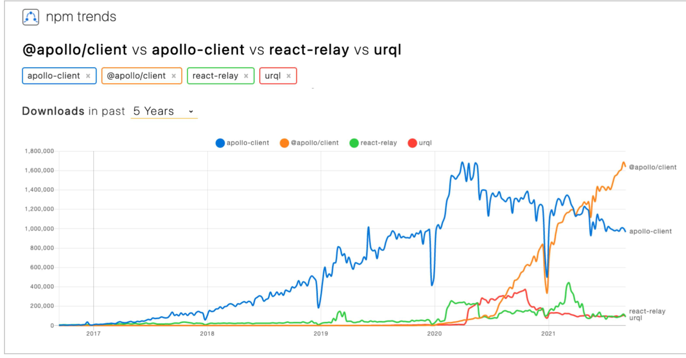

# 第13章 Suspense でデータ取得の宣言的 UI を実現する

# 13-1. Suspense とは何か

## Effect Hook で副作用を扱う難しさ

Effect Hookはそれ以前の方法と比べればかなり敷居が下がっているとはいえ、それでもまだ問題がある。

1つは無限ループに陥りやすいこと。
React はコンポーネントの state を書き換えると再レンダリングが発生するので、 `useEffect` の中で state を更新しつつ依存配列の設定を間違えると、すぐに無限ループが発生してしまう。

もう1つの問題は `useEffect` が全く宣言的ではないということ。
この点については、実験的に提供されている React の新しい機能により対応出来る。

## Suspense for Code Splitting

### バンドラによるコード分割

CRA で作成された React アプリは、デフォルトではビルド時に Webpack によってファイルがまとめられる。

※ この作業を「バンドル」、バンドルを実行するツールを「モジュールバンドラ」「バンドラ」と呼ぶ

このバンドルは、アプリが大規模になるとバンドル後のファイルサイズもそれに比例して肥大化してしまう傾向にある。
そうなると初回アクセスのアプリ起動に時間がかかってしまう。

それを防ぐため、**コード分割(code splitting)** という仕組みが最近のバンドラには存在する。
これは、バンドルファイルを適切な単位で分割、必要になった時点で動的にロードされるようにするもの。
HTTP/2 であれば複数ファイルのロードを並列で行う事ができるので、正しく活用すればパフォーマンス向上が期待できる。

この分割は、動的なインポート構文を用いることで、 webpack がそれを検出して行う。
その設定は CRA がよしなにやってくれる。

従来のような `import` ではなく、 `import` キーワードを関数として使えばコード分割が行われる。

```js
import("./math).then(({ add }) => {
  console.log(add(2, 5));
});
```

### 遅延コンポーネント

React16.6 から導入された機能。

これを使えば、動的インポートしたコンポーネントファイルを通常のコンポーネントとしてレンダリング出来る。

```js
import React from 'react';

const Foo = React.lazy(() => import('./Foo'));
```

こう書くことでビルド時にファイルが分割され、 `Foo` コンポーネントが初めてレンダリングされる時、それが含まれるバンドルファイルが自動でロードされるようになる。
なお、 `lazy` メソッドの引数は デフォルトエクスポートで React Elements を Promise で返す関数でなければいけない。

さらに、 `lazy` を使って読み込んだ遅延コンポーネントをレンダリングするのに、また別の待ち受けのための構文が必要になる。それが `Suspense` 。

```jsx
import { lazy, Suspense } from "react";

const Foo = lazy(() => import("./Foo"));

const App = () => (
  <>
    <h1>Awesome</h1>
    <Suspense fallback={<div>loading...</div>}>
      <Foo />
    </Suspense>
  </>
)
```

この `Suspense` は「サスペンスドラマ」などの「サスペンス」と同様。
*suspense* というのはもともと「何かが宙ぶらりんになって、あっちこっちに行ったりする、不安定でどっちつかずの状態」という意味。
それが転じて不安や緊張といった心理状態が続く作品のジャンルを示すようになった。(へーーー)

つまりここでは、「読み込まれているかどうかはっきりしない状態のコンポーネント」という意味になる。

*fallback* は「予備の、代替の」といった意味。
「本命が読み込まれるまでこのコンポーネントを表示していろ」という props になる。

動作 : https://codesandbox.io/s/suspense-import-bqb5t?file=/src/App.js

これが Suspense for code splitting と呼ばれるもの。

### `lazy` の実体 : Error Boundary

React のコードを読んでみると、 `lazy` はモジュールを非同期でインポートして、その Promise が解決したらそのインポートした中身を return するようになっているが、解決するまではその Promise そのものを throw している。

JavaScriptは、言語仕様として例外だけでなく文字列やオブジェクトなど何でも throw 出来るようになっている。

ライフサイクルメソッドには子孫コンポーネントの例外をキャッチしてくれる `getDerivedStateFromError` や `componentDidCatch` がある。
これらのメソッドを用いて子孫コンポーネントで throw された例外をキャッチ出来るようにしておき、例外発生時は通常のコンポーネントツリーの代わりに fallback のUI を表示してくれるようなコンポーネントのことを **Error Boundary** という。

Suspenseはこれと似ていて、「子孫コンポーネントで throw された Promise を補足、その Promise が解決するまでは fallback のコンポーネントをレンダリングし、解決したら改めて子孫コンポーネントを正常にレンダリングし直す」という動きをする。
いわば「Promise Boundary」。

「Algebraic Effects」という OCaml 等に実装されている「継続が取れる例外」を実現する機能からインスピレーションを得たらしい。

## Suspense を非同期的なデータ取得に使う : Suspense for Data Fetching

外部 API への通信の非同期処理を普通に書き、その Promise を throw する。
そして Promise が解決したらそのデータを中に埋め込んだコンポーネントを返す。
これを Suspense で待ち受けるようにすれば、データ取得が終わるまでは fallback を表示し、データ取得が完了した時点で中身が表示されるという UI が作れる。

```tsx
import React, { Suspense } from 'react';
import './styles.css';
let membersCache = null;

const membersResource = (orgCode) => {
  if (membersCache) return membersCache;

  const promise = fetch(`https://api.github.com/orgs/${orgCode}/members`)
    .then((response) => response.json())
    .then((members) => {
      membersCache = members;
    });

  throw promise;
};

const MemberList = ({ orgCode }) => {
  const members = membersResource(orgCode);

  return (
  <ul>
    {
      members.map(member => (
        <li key={member.id}>{member.login}</li>
      ))
    }
  </ul>
  );
};

constApp=()=>(
  <Suspense fallback={<div>Loading...</div>}>
    <MemberList orgCode="facebook" />
  </Suspense>
);

export default App;

// SEE: https://codesandbox.io/s/suspense-members-lucy4
```

`memberResource` は データ取得が完了するまでは `promise` を throw し、取得後はそのデータを返してくれる関数。
`memberResource` の返り値を `MemberList` コンポーネントの中で普通に使っているが、 `<Suspense>` でラップすることで上手く遅延を解決してくれる。

このコードの前半だけ隠して `MemberList` と `App` だけ見てみれば、非同期処理が宣言的に書けていると言え無くもない。
Promise を throw する部分、 `membersCache` というグローバル変数を使っている点が主な問題なので、そこを隠蔽出来れば良さそう。

# 13-2. Suspense Ready なデータ取得ライブラリ

Suspense を使うと非同期なデータ取得を伴う副作用処理をいい感じに宣言的UIで書ける。
ただし、そのためのリソース生成部分の可読性が低い。

リソース生成部分をいい感じにラップしてくれる、かつキャッシュ機能を持つライブラリを使うと良い。

***

## GraphQL クライアントライブラリ



### Relay

Facebook 製の GraphQL クライアント。
Facebook 規模のシステムに特化していて、癖が強く学習コストが高い。

### Apollo

Graph QL クライアントの中ではかなり勢いがあるライブラリ。
ただし、 Suspense 対応はいつになるか未定。(2022年8月現在未対応)

### urql (Universal React Query Library)

[FormidableLabs/urql](https://github.com/FormidableLabs/urql)

Suspense の対応がかなり進んでいる GraphQL クライアントのライブラリ。
Formidable というシアトルに本社のある企業が事業の一環として作っているライブラリなので、信頼性はそれなりに高い。

りあクト作者は今から導入するならこれがおすすめだそう。

***

## Restful API 用のデータフェッチライブラリ

サーバーサイドが RESTful API だったり、 Firebase を始めとする Baas の場合はバックエンドや通信プロトコルに対して不可知論的、かつキャッシュ機能が統合されたデータフェッチライブラリを使うと良い。

この条件に該当するライブラリは現状 SWR と TanStack Query(React Query) の二択。

### SWR - Next.js で有名な Vercel 社製ライブラリ

[Getting Started – SWR](https://swr.vercel.app/docs/getting-started)

SWR は **Stale-While-Revalidate** という用語から来ている。
stale とは「新鮮ではない、古くなった」という意味の形容詞。

基本動作は以下。

1. 該当データにアクセスしたとき、キャッシュされた値があってその取得日時が任意の許容期間内ならいったんそのキャッシュ値を返す。そしてその裏でサーバにリクエストを行い、その取得したデータ内容に変更があればキャッシュを更新、もう一度あらためてその値を返す
2. 該当データにアクセスしたとき、キャッシュされた値がなかったり、あったとしてもその取得日時が任意の許容期間を過ぎていたら、直接サーバにリクエストしてデータを取得しその値を返す。さらにその後、そのデータをキャッシュしておく

### SWRクイックスタート: `useSWR`

```tsx
// クイックスタート
import React, { FC } from "react";
import useSWR from "swr";
import "./styles.css";

const getUser = async (userId: number | string) =>
  (await fetch(`https://jsonplaceholder.typicode.com/users/${userId}`)).json();

const App: FC = () => {
  const { data } = useSWR("user/3", () => getUser(3));
  // const { data } = useSWR("3", (id) => getUser(id));
  // const { data } = useSWR("3", getUser);
  // const { data } = useSWR([3, "user"], (id, _) => getUser(id));
  // const { data } = useSWR([3, "user"], getUser);

  return (
    <div className="App">
      {data ? (
        <>
          <h2>{data.name}</h2>
          <p>User ID: {data.id}</p>
          <p>Email: {data.email}</p>
          <p>Phone: {data.phone}</p>
        </>
      ) : (
        <h2>Loading...</h2>
      )}
    </div>
  );
};

export default App;
// SEE: https://codesandbox.io/s/swr-8rw4g
```

`useSWR` という Hooks インターフェースを使う。
第1引数がキャッシュを一意に特定するためのキー( key )、第2引数がデータ取得のための非同期関数( fetcher )。

第1引数のキーは文字列か配列、 `null` 及びそれらを返す関数を渡すことが出来る。
データが異なるのに同じキーを使ってしまうと当然ながら意図しない挙動になる。

キーに `null` を渡すとどうなるのか。
`useSWR` はキーが falsy な値になっている間は fetcher によるデータ取得が実行されない。
`useSWR(shouldFetch ? "user/1" : null, fetcher)` のように記述することで、 boolean 変数 `shouldFetch` の値によって fetcher を実行するかどうかを振り分ける事ができる。

第2引数について。SWR はデータ取得に関して「不可知論的」。
fetcher となる関数はブラウザ標準の fetch だろうが axios だろうが、Firestore のデータ取得関数だろうが、実体のデータを Promise で返す関数なら何でも良い。

また、第1引数を第2引数 fetcher 関数の引数として使える。
つまり、文字列 `3` をキーに出来れば上の例は以下のように書ける。

```ts
const {data} = useSWR("3", (id) => getUser(id));
```

更に、 fetcher 自身の引数と中の関数に渡している引数が同じ `id` なので、下のように省略出来る。

```ts
const {data} = useSWR("3", getUser);
```

キーには配列も使える。

```ts
const { data } = useSWR([3, "user"], (id, _) => getUser(id));
```

上では `(id, _)` として配列の2番めの要素を捨てているが、最初から受け取らない事もできる。

```ts
const { data } = useSWR([3, "user"], getUser);
```

上で挙げたように、キーが falsy な値だった場合 fetcher は実行されない。
これを利用して任意の条件でデータを取得するかどうか振り分けられる。 Conditional Fetching と呼ばれるやり方。

```tsx
const EnhancedUserProfile: VFC <{ userId?: string }> = ({ userId }) => {
  const { data: user } = useSWR(userId && [userId, 'user'], getUser);

  return <UserProfile user={user} />;
};
```

### SWRクイックスタート: `mutate`

キャッシュデータ書き換えのための関数で、任意のキーのデータを fetcher の再実行で更新したり、生の値で書き換えたり出来る。

```ts
const {data} = mutate(key, data?, shouldRevalidate?)
```

第2引数 `data` を省略すれば fetcher の再実行によるキャッシュ更新、値を渡せばそれによりキャッシュが更新される。

第3引数 `shouldRevalidate` は書き換え後に改めて fetcher を実行するかどうか。
デフォルトでは `true` になっている。

### Vercel 社

SWRの開発元。

サーバーサイドレンダリング(SSR) や 静的サイト生成(SSG) が簡単に実現できる React のフレームワークである Next.js や、
フロントエンド用の Paas である Vercel を提供している会社。

***

### TanStack Query - 個人開発ながら多機能で進化が早い

TanStack Query (旧React Query) もSWRと同様の機能を持つ。

```tsx
import React, { FC } from "react";
import { useQuery } from "react-query";
import "./styles.css";

const getUser = async (userId: number | string) =>
  (await fetch(`https://jsonplaceholder.typicode.com/users/${userId}`)).json();

const App: FC = () => {
  const { data } = useQuery([3, "user"], () => getUser(3));

  return (
    <div className="App">
      {data ? (
        <>
          <h2>{data.name}</h2>
          <p>User ID: {data.id}</p>
          <p>Email: {data.email}</p>
          <p>Phone: {data.phone}</p>
        </>
      ) : (
        <h2>Loading...</h2>
      )}
    </div>
  );
};

export default App;
```

`useQuery` が `useSWR` と異なる点は、クエリのキーを fetcher 関数の引数に持ち越せないこと。

conditional fetching 、 TanStack Query では dependent queries (依存クエリ) は、SWRと異なり明示的に示す必要がある。
第3引数に boolean の `enabled` を設定でき、これが `true` だった時のみ fetcher関数が実行される。

```tsx
const EnhancedUserProfile: VFC <{ userId?: string }> = ({ userId }) => {
  const { data: user } = useQuery(
    [userId, 'user'],
    () => getUser(userId),
    { enabled: !!userId },
  );
return <UserProfile user={user} />; };
```

`useQueryClient` という Hooks API の返り値である `queryClient` オブジェクトはメソッドを豊富に持っている。
以下はその一例。

- `queryClient.prefetchQuery` ...... fetcher からあらかじめデータを取得してキャッシュしておく
- `queryClient.getQueryDat`a...... ローカルキャッシュから値を読み取る
- `queryClient.setQueryDat`a...... ローカルキャッシュに直接データを書き込む
- `queryClient.invalidateQueries` ...... fetcher を再実行してデータを取得、キャッシュを上書きする
- `queryClient.removeQuerie`s...... ローカルキャッシュから値を削除する
- `queryClient.clea`r...... すべてのローカルキャッシュをクリアする

この他にも無限スクロールのための `useInfiniteQuery` 、非同期のデータ取得を複数並列して行う `useQueries` などの Hooks APIが提供されている。

更にはガベージコレクションまで用意されている。デフォルトでは5分間使用されなかったキャッシュは自動的に削除されるようになっている。

Redux のような DevTools も用意されている。

### SWR vs TanStack Query

結論から言うと、TanStack Queryの方が圧倒的に多機能。
おすすめは TanStack Query の方。

TanStack Queryの問題点としては、進化が早く破壊的変更が多い点。
それ以外には特に無い。

## React Query with Suspense
