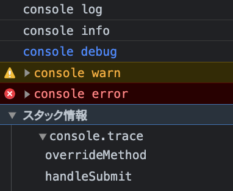
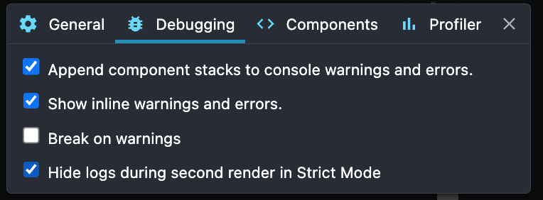

# 11-1. React アプリケーションのデバッグ

## コンソールにデータをダンプする

### `console.log`

プレースホルダが使える。

```ts
>console.log('%d users added',30); //%d:整数, %f:浮動小数点数, %s:文字列
30 users added

> console.log('object is %o', { id: 1, name: 'john' });
object is { id: 1, name: "john" }
```

### ログレベルが異なるメソッド

ログレベルが異なる `info` `debug` `warn` `error` がある。



### オブジェクトのダンプ

正直 `console.table` 以外微妙。 `console.log` で良いわ。

- `console.dir` : JSON状のツリーとして出力
- `console.dirxml` : JSON状のツリーとして出力。DOMはHTML状のツリーにして表示。
- `console.table` : データを表形式で出力

### 回数の計測

`console.count` を使う。
ラベルを付ける事ができる。
`console.countReset` でリセット出来る。

```ts
> [1,2,3,4,5].forEach(() => console.count('foo'))

foo: 1
foo: 2
foo: 3
foo: 4
foo: 5
```

### 時間の計測

```ts
> console.time('Done');
> [Array(1000).keys()].forEach((i) => i)
> console.timeEnd('Done');

Done: 0.051025390625 ms
```

### 処理の一時停止

`console.assert` を使うと処理を一時停止させることが出来る。

与えられる条件によって出力有無が決まる。 `false` の時出力。

## React Developer Tools

***

## Components タブ

### 設定

#### debuggingタブ

Strict モードを適用していると、開発モードでは厳密な検証のためにコンポーネントが2回レンダリングされる。

ログ出力が2回されることを防ぐには、Debugging タブの 「Hide logs during...」にチェックを入れておく。



この設定でも `useEffect` 内の処理は2回表示される。これは、冪等性を保証しロという公式からの示唆。

#### components タブ

「Hide components where...」に `type: host(e.g. <div>)` が無ければ追加。

#### Profiler タブ

「Record why each component rendered while profiling」にチェックするとなぜそのコンポーネントがレンダリングされたのかわかる。

#### General タブ

「Highlight updates when components render」にチェックするとレンダリングされたコンポーネントがハイライトされる。

### 操作


- ツールペイン左上の要素指定アイコンをクリックして画面から要素を選択するか、検索ボックスに名前を入力して目当てのコンポーネントを指定可能
- props や hooks によって保持している値を見ることが出来る
  - state の変更なども可能

- 虫アイコン : そのコンポーネントの情報をコンソールにダンプ
- <> アイコン : 対応するソースコードを開く
  - ブレークポイントを設定、そのコンポーネントの状態を確認したり、変数を確認したり出来る
-

## Profiler タブ

### 操作

ペイン左上の青丸をクリックすると計測開始。
