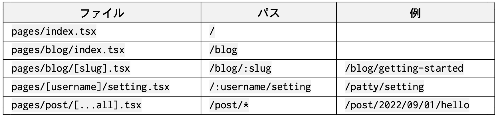

# ルーティングについて

## ファイルベースのルーティング

React エコシステム全体ではファイルベースのルーティングを採用することが多い。

現在では React をベースにしたフレームワークがいくつもでていて、それらは React 単体では機能が足りなかったり設定が面倒だったりするものを補ってくれる。

最もメジャーなのが Next.js で、SSR や画像の最適化、コンテンツの国際化などが簡単にできる。

ルーティングの機能も用意されていて、ファイルの構造がそのままアプリケーションのパスになるというもの。



素の React で使うことは難しい。
Vite の場合は vite-plugin-pages というプラグインがあるが、2022年9月現在実験的。

# React Router

## `Route` コンポーネント

注意点

- ルートは `/` で表現されるが、ルート以外の `path` の先頭には `/` を付けない。
- 大文字・小文字を区別したい場合は `Route` コンポーネントに `caseSensitive` 属性を指定する
- 「マッチしなかった場合」を表現したければ、ワイルドカードを使う。

```tsx
import type { FC } from 'react';
import { Routes, Route } from 'react-router-dom';
import Home from 'components/templates/Home';
import About from 'components/templates/About';
import StaffProfile from 'components/templates/StaffProfile';
import { PostList, Post } from 'features/blog';

const AppRoutes: FC = () => {
  return (
    <Routes>
      <Route path="about" element={<About />} />
      <Route path="staff">
        <Route path=":id" element={<StaffProfile />} />
      </Route>
      <Route path="blog">
        <Route path="" element={<PostList />} />
        <Route path="post/*" element={<Post />} />
        { /* どの投稿にもマッチしない場合 */ }
        <Route path="*" element={<PostNotFound />} />
      </Route>
      <Route path="/" element={<Home />} />
      { /* 全くマッチしない場合 */ }
      <Route path="*" element={<Navigate to="/" replace />}>
    </Routes>
  );
};
```

## `Link` コンポーネント

```tsx
<ul>
  <li>
    <Link to="/">トップページ</Link>
  </li>

  <li>
    <Link to={{
      pathname: '/contact',
      search: '?from=here',
      hash: '#subject',
    }}
      state={{ secretCode: '8yUfa9KECH' }}
    >
      お問い合わせ
    </Link>
  </li>

  <li>
    <Link to="/anywhere" replace>今ここではないどこか</Link>
  </li>
</ul>
```

`to` に文字列を渡すか、[history](https://github.com/remix-run/history)で定義されている `Path` インターフェイスの各要素を渡すか。

```ts
interface Path {
  pathname: string;
  search: string;
  hash: string;
}
```

## `NavLink`

[API Reference | React Router #nav link](https://reactrouter.com/en/v6.3.0/api#navlink)

今現在、そのパスにマッチする場所にいるかどうかを属性に渡せる特殊な `Link` 。

## `Outlet`

小ルート要素のコンポーネントをレンダリングするために用意しておくプレースホルダ的なコンポーネント。

この場合 `users/me` なら `SelfProfile` が、それ以外は `UserProfile` がレンダリングされる。

```tsx
constApp:FC=()=>(
  <Routes>
    <Route path="users" element={<Users />}>
      <Route path="me" element={<SelfProfile />} />
      <Route path=":user_id" element=    {<UserProfile />} />
    </Route>
    <Route path="/" element={<Home />} />
  </Routes>
);
const Users: FC = () => (
  <div>
    <h2>プロフィール</h2>
    <Outlet />
  </div>
);
```
