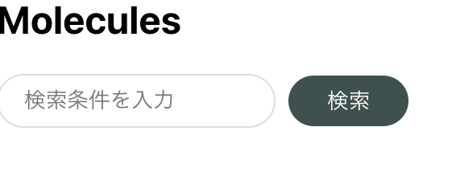
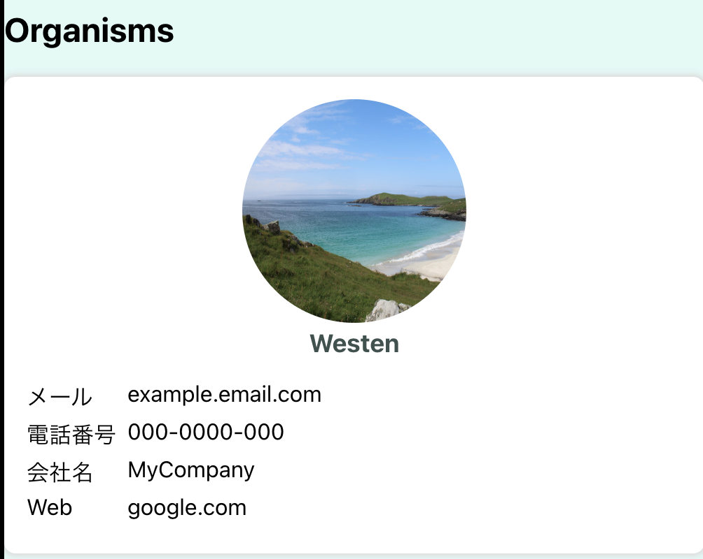

# Atomic Design

## 開発の進め方

1. 必要となる atoms から作る
2. いくつか atoms が出来たらそれを組み合わせて出来る molecules を作る
3. atoms, molecules を複数作ったらそれを組み合わせて organisms を作る
4. organisms を作る中で共通化できそうな箇所、使いまわせそうな箇所があれば atoms, molecules として切り出していく

## 概要

コンポーネントを適切な粒度で分割するための手法の一種。

### Atoms

Atom : 原子

最小構成要素。

例 : アイコン、ボタン

### Molecules

Molecule : 分子 (モラキュールズ)

Atoms の組み合わせからなる部品。

例 : アイコン + 入力ボックス、アイコンセット

### Organisms

Organisms : 生物

Atoms や Molecules の組み合わせからなる、単体で意味を持つ要素群。

例 : サイドメニュー、ツイートエリア(アイコンセット + 入力ボックス)

### Templates

レイアウト情報。
注意点として、実データは持たないこと。

### Pages

1つのページ。

## Atoms の例

```tsx
// PrimaryButton.tsx
import styled from 'styled-components';

const SButton = styled.button`
  background-color: #40514e;
  color: #fff;
  padding: 6px 24px;
  border: none;
  border-radius: 100px;
  outline: none;
  &:hover {
    cursor: pointer;
    opacity: 0.8;
  }
`;

// NOTE : props は外から受け取るべき
const PrimaryButton: React.FC = ({ children }) => (
  <SButton type="button">{children}</SButton>
);

export default PrimaryButton;
```

### 共通部分を切り出す

実際のアプリケーションでは1つの部品が複数存在することが多い。
(`PrimaryButton` に加えて `SecondaryButton` も追加したい、など)

そうなった場合、共通部分は切り出しておくと良い。

```tsx
// BaseButton.tsx
import styled from 'styled-components';

// 共通部分を切り出したベースとなるボタン
const BaseButton = styled.button`
  color: #fff;
  padding: 6px 24px;
  border: none;
  border-radius: 100px;
  outline: none;
  &:hover {
    cursor: pointer;
    opacity: 0.8;
  }
`;

export default BaseButton;
```

```tsx
// PrimaryButton.tsx
import styled from 'styled-components';
import BaseButton from './BaseButton';

const SButton = styled(BaseButton)`
  background-color: #40514e;
`;

const PrimaryButton: React.FC = ({ children }) => (
  <SButton type="button">{children}</SButton>
);


// SecondaryButton.tsx
import styled from 'styled-components';
import BaseButton from './BaseButton';

const SButton = styled(BaseButton)`
  background-color: #11999e;
`;

const SecondaryButton: React.FC = ({ children }) => (
  <SButton type="button">{children}</SButton>
);
```

## Molecules の例

検索ボックス + 検索ボタンを作ってみる。

atoms で /button と /input を用意。

```tsx
import styled from 'styled-components';
import Input from '../atoms/input/Input';
import PrimaryButton from '../atoms/button/PrimaryButton';

const SContainer = styled.div`
  display: flex;
  align-items: center;
`;

const SButtonWrapper = styled.div`
  padding-left: 8px;
`;

const SearchInput: React.FC = () => (
  <SContainer>
    <Input placeholder="検索条件を入力" />
    <SButtonWrapper>
      <PrimaryButton>検索</PrimaryButton>
    </SButtonWrapper>
  </SContainer>
);

export default SearchInput;
```

`SButtonWrapper` で `PrimaryButton` ⇔ `Input` 間に `padding` を挿入。

`SContainer` で要素を横並びにしている。



## Organisms の例

atoms, molecules を組み合わせて作る。



## Templates の例

## Pages の例
