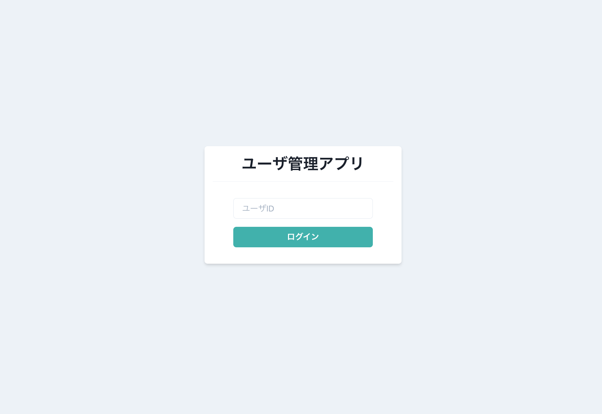

# ChakraUI を使ったサンプルアプリ

# UI コンポーネントライブラリ

Chakra UI は UI コンポーネントライブラリの一種。勢いがある。

- [MUI](https://mui.com/)
- [React-Bootstrap](https://react-bootstrap.github.io/?ref=morioh.com&utm_source=morioh.com)
- [Ant Design](https://ant.design/?ref=morioh.com&utm_source=morioh.com)
- [Tailwind CSS](https://tailwindcss.com/)
- [Semantic UI](https://semantic-ui.com/)
- [Chakra UI](https://chakra-ui.com/)

## Chakra UI

### リファレンス

- [Chakra UI](https://chakra-ui.com/)
- テーマカラー : [Default Theme - Chakra UI](https://v1.chakra-ui.com/docs/styled-system/theming/theme)

### クイックスタート

```json
"dependencies": {
  "@chakra-ui/icons": "1.0.4",
  "@chakra-ui/react": "1.2.1",
  "@emotion/react": "11.1.4",
  "@emotion/styled": "11.0.0",
  "framer-motion": "3.3.0-beta.22",
}
```

```tsx
import './App.css';
import { FC } from 'react';
import { Button, ChakraProvider } from '@chakra-ui/react';

const App: FC = () => (
  <ChakraProvider>
    <Button colorScheme="teal">ボタン</Button>
  </ChakraProvider>
);

export default App;
```

### 基本的な使い方 : ヘッダー

例としてヘッダーを構築する。

`Flex` は flex-box 対応したコンテナ、 `Heading` は `h1` や `h2` 等を表す見出し。

- `as` でどのHTMLタグとしてレンダリングするか
- `color` `bg` でどの色にするか
- `align` `justify` などで flex-box の設定
- `IconButton` にアイコン (ここでは `HamburgerIcon` ) を渡すとそのアイコンのボタンができる
- `Drawer` を使って展開可能な UI を作る事ができる

設定を `{base: 3, md: 5}` のようなオブジェクトとして渡すことで、各ブレークポイントで要素の大きさを変更してくれる。

```tsx
import { memo, VFC } from 'react';

import {
  Button,
  Flex,
  Heading,
  Link,
  Box,
  IconButton,
  Drawer,
  DrawerOverlay,
  DrawerContent,
  DrawerBody,
  useDisclosure,
} from '@chakra-ui/react';
import { HamburgerIcon } from '@chakra-ui/icons';

const Header: VFC = memo(() => {
  const { isOpen, onOpen, onClose } = useDisclosure();

  return (
    <>
      <Flex
        as="nav"
        bg="teal.500"
        color="gray.50"
        align="center"
        justify="space-between"
        padding={{ base: 3, md: 5 }}
      >
        {/* ヘッダータイトル */}
        <Flex align="center" as="a" mr={8} _hover={{ cursor: 'pointer' }}>
          <Heading as="h1" fontSize={{ base: 'md', md: 'lg' }}>
            ユーザ管理アプリ
          </Heading>
        </Flex>

        {/* ヘッダーメニュー */}
        <Flex
          align="center"
          fontSize="sm"
          flexGrow={2}
          display={{ base: 'none', md: 'flex' }}
        >
          {/* ヘッダーリンク */}
          <Box pr={4}>
            <Link href="*">ユーザ一覧</Link>
          </Box>
          <Link href="*">設定</Link>
          {/* ハンバーガーメニュー */}
        </Flex>
        <IconButton
          icon={<HamburgerIcon />}
          aria-label="メニューボタン"
          size="sm"
          variant="unstyled"
          display={{ base: 'block', md: 'none' }}
          onClick={onOpen}
        />
      </Flex>

      {/* 展開可能なメニュー */}
      <Drawer placement="left" size="xs" onClose={onClose} isOpen={isOpen}>
        <DrawerOverlay>
          <DrawerContent>
            <DrawerBody p={0} bg="gray.100">
              <Button w="100%">TOP</Button>
              <Button w="100%">ユーザ一覧</Button>
              <Button w="100%">設定</Button>
            </DrawerBody>
          </DrawerContent>
        </DrawerOverlay>
      </Drawer>
    </>
  );
});

export default Header;
```

### 基本的な使い方 : ログイン画面



- `Stack` : 囲んだ要素を等間隔に並べる事ができる
- `Divider` : ディバイダー
- `Button`
  - `isLoading` : ローディングアニメーションを表示

```tsx
// molecules/Login.tsx
import { ChangeEvent, memo, useState, VFC } from 'react';
import { Flex, Box, Heading, Divider, Input, Stack } from '@chakra-ui/react';

import PrimaryButton from '../atoms/button/PrimaryButton';
import useAuth from '../../hooks/useAuth';

const Login: VFC = memo(() => {
  const [userId, setUserId] = useState('');
  const { login, isLoading } = useAuth();

  const onChangeUserId = (e: ChangeEvent<HTMLInputElement>) =>
    setUserId(e.target.value);
  const onClickLogin = () => login(userId);

  return (
    <Flex align="center" justify="center" height="100vh">
      <Box bg="white" w="sm" p={4} borderRadius="md" shadow="md">
        <Heading as="h1" size="lg" textAlign="center">
          ユーザ管理アプリ
        </Heading>
        <Divider my={4} />
        <Stack spacing={4} py={4} px={10}>
          <Input
            placeholder="ユーザID"
            onChange={onChangeUserId}
            value={userId}
          />
          <PrimaryButton
            text="ログイン"
            onClick={onClickLogin}
            isLoading={isLoading}
            disabled={userId === '' || isLoading}
          />
        </Stack>
      </Box>
    </Flex>
  );
});

export default Login;
```

ログインに関する処理はカスタムフックに切り出しておく。

```tsx
// hooks/useAuth.tsx
import axios from 'axios';
import { useCallback, useState } from 'react';
import { useHistory } from 'react-router-dom';

import { User } from '../types/user';

const API_URL = 'https://jsonplaceholder.typicode.com/users';

const useAuth = () => {
  const history = useHistory();
  const [isLoading, setIsLoading] = useState(false);

  const login = useCallback(
    (id: string) => {
      setIsLoading(true);

      axios
        .get<User>(`${API_URL}/${id}`)
        .then((_) => {
          history.push('/home');
        })
        // [axiosでのエラーハンドリング - こなさんち](https://cresta522.hateblo.jp/entry/20201231/1609378592)
        .catch((error: { response: { status: number } }) => {
          if (error.response.status === 404) {
            alert(`IDが ${id} のユーザは存在しません`);
          } else {
            alert('ログインに失敗しました');
          }
        })
        .finally(() => {
          setIsLoading(false);
        });
    },
    [history],
  );

  return { login, isLoading };
};

export default useAuth;
```
